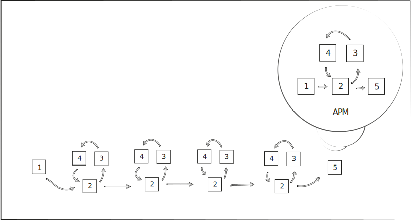
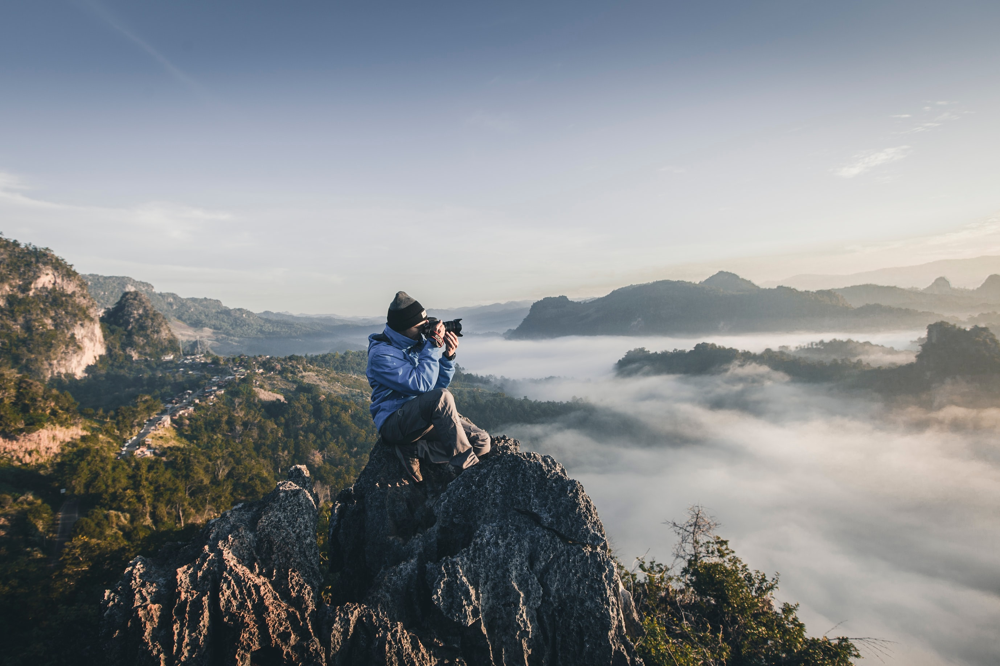

# Content production

{: .no_toc }

## Table of contents
{: .no_toc .text-delta }

1. TOC
{:toc}

---

<!--
- add outline for the page (TOC)
- could fine tune podcast part with EAD (but might take too much time)
- add more feature images for sections towards the end
- add more info to writing (or refer to the draft)
- check grammar
- raw vs compressed files
- presentation with PP, Google Slides or Prezi 
- working on mobile (vs laptop)
- app: NameChanger
- web: cyberduck, vis.js
- colour combinations
- mailinglist: MailChimp
- "we must be thought how to think, not what to think"
-->


## 1. APM
As a content producer, you could be in charge of all stages of the [APM](project-management.md):

1. defining the goals
2. designing a suitable workflow 
3. developing the content (e.g. by creating a podcast, designing a logo, writing text, finding or taking photographs)
4. asking for feedback from peers/professionals on drafts 
5. contextualising, publishing and disseminating the finished content

<br><br>


<br><br>

## 2. content types
Your website can focus on the use of one of these materials (modalities):

- still images (e.g. photography on [oliverpattison.com](https://oliverpattison.com/), [11route.com](https://11route.com/))
- moving image (e.g. short films on [www.short-films.com](https://www.short-films.com/))
- audio only (e.g. on podcasts on [songexploder.net](https://songexploder.net/), [tricksterpodcast.com](https://tricksterpodcast.com/))
- text (e.g. an [article](https://consilienceproject.org/education-crisis/), collections of [poetry](https://ttc.tasuki.org)) 

Your content could also use these in different proportions (e.g. [1](https://www.shutterstock.com/blog/climate-change-effects-photos), [2](https://mashable.com/article/best-climate-change-documentaries), [3](https://directorsnotes.com/2022/09/28/emma-miranda-moore-run/)).

>A picture is worth a thousand words. ~ Anonymous

> The sound and music are 50% of the entertainment in a movie. ~ George Lucas

> There are things in the book you could never do in a movie. ~ Noah Hathaway

<br><br>

## 3. materials

 photo by <a href="https://unsplash.com/@oksdesign?utm_source=unsplash&utm_medium=referral&utm_content=creditCopyText">Oxana Melis</a> on <a href="https://unsplash.com/@oksdesign?utm_source=unsplash&utm_medium=referral&utm_content=creditCopyText">Unsplash</a>

<br>

When creating content for your website, you could consider using

1. still images e.g. 
   - [photography](https://unsplash.com/)
   - [computer graphics](https://www.freepik.com/vectors/graphics)
   - diagrams (e.g. made with [Inkscape](https://inkscape.org/), [RAWGraphs](https://www.rawgraphs.io/))
   - could be used for
     - logos and [favicons](https://favicon.io/)
     - feature/header images on the top of a page
     - between text
     - videos

2. audio e.g. 
   - [sound recordings](https://freesound.org/)
   - [sound effects](https://mixkit.co/free-sound-effects/)
   - [music](https://www.silvermansound.com/free-music)
   - could be used in
     - podcasts
     - videos

3. moving images e.g. 
   - [films](https://www.pexels.com/search/videos/construction/) (movie clips) made with cameras
   - [computer generated animations](https://www.videvo.net/free-motion-graphics/)
    - dynamic content (e.g. [made with computer code](https://cs.nyu.edu/~kapp/cs101/processing_on_the_web/))


4. text e.g. 
   - [poetry](https://writeme.ai/poetry/)
   - [prose](https://sociable.co/government-and-policy/how-globalists-governments-digital-id-climate-covid-cybersecurity-cbdc/)
   - [quotes](https://www.goodreads.com/quotes/tag/hermann-hesse)
   - computer code e.g. 

```
if ( you.happy == true ) {
    i.happy = true
}
else {
    i.happy = false
}
```

<br><br><br>

 photos by <a href="https://unsplash.com/@nate_dumlao?utm_source=unsplash&utm_medium=referral&utm_content=creditCopyText">Nathan Dumlao</a> and <a href="https://unsplash.com/@kellysikkema?utm_source=unsplash&utm_medium=referral&utm_content=creditCopyText">Kelly Sikkema</a> on <a href="https://unsplash.com/s/photos/buying?utm_source=unsplash&utm_medium=referral&utm_content=creditCopyText">Unsplash</a><br>

## 3. materials to 'take or make'
Where to get these source materials from?

1. take it (free or paid)
2. make it (i.e. DIY)

<br>

### 1. take it
Free and paid materials can have different requirements regarding

- attribution (e.g. regarding private/commercial use or whether you need to credit the creator or not)
- repurposing (e.g. whether you can amend the source material or not)
- stock libraries can list 
  - free and paid materials (e.g. [Unsplash](https://unsplash.com/images))
  - only paid materials (e.g. [Envato](https://studio.envato.com/))
  - only free materials (e.g. [Freesound Project](https://freesound.org/))

<br>

Examples of free images in use

- the images embedded in this file are all from Unsplash
   - the first image is used in its original form
   - the second image is a collage of three photos (modification allowed by [Unplash license](https://unsplash.com/license))
   - although it wasn't required, I gave credit to the photographers ) maybe because I like when [my photos are credited](http://www.ludions.com/projects/lichens/) as well)

further info on using free materials:

- [creativecommons.org](https://creativecommons.org/)
- [differencebetween.net](http://www.differencebetween.net/business/difference-between-creative-commons-and-public-domain/)

<br>

### 2. make it
To make your own material you can 

1. often repurpose, reuse or amend free material (check licence!) (e.g. as I did repurpose graphics for this [poster](https://khofstadter.com/c/) and a sound recording for a [music release](https://khofstadter.com/swimming/))
2. start from scratch (e.g. as I did for the cover art and sound synthesis of [flow](https://khofstadter.com/flow-in-metamorphosis/))

<br>
<br>
<br>

## 4. materials and content in more detail

### 1. still images

- computer graphics (vectors or pixels)
- photography (pixels)

<br><br>

<br><br>

<br><br>

- main advantages:
  - pixels (e.g. photos can provide more depth/detail)
  - vector graphics (e.g. better scaling)
  - [search for more info if needed](https://duckduckgo.com/?q=pixel+vs+vector)

<br>

#### sources for taking
- [Unsplash](https://unsplash.com/images/stock)
- [Vecteezy](https://www.vecteezy.com/free-vector/vector)
- more? Search with keywords 'free photography', 'free images' or 'free vector images', 'photo stock library' etc.
- you can also ask people on [Flickr](https://khofstadter.com/if-only/), [Behance](https://khofstadter.com/digitones/) whether you could use their images
- remember to check the required attributions and how you can use (repurpose) the image

<br>

#### hardware/software for making
1. pixel work
  
> "The best camera is the one you have." 

- [*but is it?*](https://www.lightstalking.com/best-camera-one-with-you/)
- consider light and composition first (more tips [here](https://www.lightstalking.com/best-camera-one-with-you/))
- if you can, shoot in RAW format to allow room for editing
- you can do serious work with [Gimp](https://www.gimp.org/) (a free [Photoshop](https://www.adobe.com/uk/products/photoshop.html) alternative)
- search for 'Photoshop alternatives' for other software

<br>

2. vector work 
- you can do serious work with [Inkscape](https://inkscape.org/) (a free [Illustrator](https://www.adobe.com/uk/products/illustrator.html) alternative)
- search for 'Illustrator alternatives'

#### further resources
- [logosbynick.com](https://logosbynick.com/graphic-design-computer-requirements-2021/)
- [ImageOptim](https://imageoptim.com/mac)
- [diagrams.net](https://www.diagrams.net/)
- [Gimp vs Inkscape](https://thegimptutorials.com/gimp-vs-inkscape/) (pixels vs vectors)
- [AI Image Description](https://www.astica.org/vision/describe/) - could be used for Alt Text

<br>

*How could your website benefit from still images?*

<br><br>

### 2. audio
materials:

- sound recordings
- sound effects
- music

content:

- podcasts
- music

<br>

#### types of podcasts
1. interview or presentation recordings
  
   - attention is paid on people talking
   - organic narrative
   - example:
     - [Rebel Wisdom](https://rebelwisdom.podbean.com/)
     - [Eckhart Tolle](https://podcast.app/eckhart-tolle-essential-teachings-p687019/)
   - sometimes it's the audio-only version of the original video format

2. storytelling with mixed material e.g. sound design and music, narration, interview clips

   - more artistic
   - edited narrative
   - examples:
      - [Trickster The Many Lives of Carlos Castaneda](https://tricksterpodcast.com/)
      - [Good In Theory](https://goodintheorypod.com/)
      - [Song Exploder](https://songexploder.net/)

<br>

#### microphones/speakers/headphones
- for quality recordings, use a condenser mic ([not a dynamic mic](https://duckduckgo.com/?q=condenser+vs+dynamic+mic))
- isolate noises when recording as much as possible (unless they are part of your soundscape e.g. your storytelling)
- record in high sample rate
- use quality headphones/speakers (called monitors) when editing audio
- show Zoom H1, binaural mic, gooseneck, windshield, jack cable 

<br>

#### software
production stages:

1. can involve recording/sound design/music composition
2. editing
3. mixing
4. mastering

- big productions have different people for each of these stages, but the whole production can be done by one person too
- stages can be done in one software, a Digital Audio Workstation (e.g. like [Reaper](https://www.reaper.fm/), [Pro Tools](https://www.avid.com/pro-tools), [Logic Pro](https://apps.apple.com/gb/app/logic-pro/id634148309?mt=12), Audacity, Adobe Audition)
- however, sometimes specific software/hardware is used for specific stages (e.g. recording can be done with [portable recorders on SSD cards](https://www.zoom.co.jp/products/handy-recorder/h1-handy-recorder) or straight on the computer's HDD in a [studio](https://unsplash.com/s/photos/studio-recording))
- consider panning mono, stereo and perhaps surround or [binaural](https://www.soundonsound.com/techniques/introduction-binaural-recording) audio techniques) – note, there is a difference between binaural audio recording and [binaural beats](https://duckduckgo.com/?q=binaural+beats&t=brave&ia=web))

<br>

#### sources for taking audio
  - https://freesound.org/
  - more? search for 'audio stock libraries', 'free audio samples', 'free music', 'public domain music', etc. 

<br>
    
*How could your website benefit from audio materials/content?*

<br><br>

## 3. moving images
source material:

- films (movie clips made with a camera)
- computer-generated animation clips
- computer screen recordings (screencasts)
- still images
- audio 

<br>

### moving image type
1. simple interview or presentation recordings (e.g. [a lecture's archive](https://www.youtube.com/user/johnvervaeke/videos), similar to interview and presentation type podcasts)
2. storytelling with mixed material (e.g. [sound design, music and narration, graphic design](https://www.youtube.com/c/theschooloflifetv/videos))
3. screencast (e.g. [demonstrating the use of a specific software](https://youtu.be/6oTBMjbImHo))
4. short film/animation (documentary or artistic/dramatised)

<br>

#### production stages
- similar to the audio production stages above
1. pre-production (e.g. discussions, designing ideas, drawings, temp tracks)
1. production (e.g. shootings / graphics rendering / sound recording on sets)
2. post-production, editing (e.g. arrangement of clips, linking audio and visuals, foley, colour tuning, noise reduction, dubbing mix, etc.)

<br>

#### hardware/software
to record films:

- smartphones, camcorders, video cameras, webcams (choose according to project's needs)

to create animations:

- search for '[compare animation software](https://duckduckgo.com/?q=compare+animation+software&t=brave&ia=web)' 

to record audio:

- inbuilt or external microphones (for better quality use external, condenser microphones)

to edit videos: 

- [Premier](https://www.adobe.com/uk/products/premiere.html), [iMovie](https://www.apple.com/uk/imovie/), [Final Cut Pro](https://www.apple.com/uk/final-cut-pro/), [DaVinci Resolve](https://www.blackmagicdesign.com/products/davinciresolve/), [OpenShot](https://www.openshot.org/),  
  - some available on lab PCs,  ... search for 'video editing software'

to edit audio:

- most video editing software provide you with good audio editing functions
- but, you can export the audio from the final video and edit/mix/master in a software specialised for audio work (e.g Reaper)

to make screenrecordings/screencasts:  

- [Screencast-O-Matic](https://screencast-o-matic.com/) (available on lab PCs)
  - [tutorial](https://www.youtube.com/watch?v=LAg4_eFITNc)
  - can't edit with the free version nor record computer audio but offers screen+webcam even without making an account
  - limited to 15 minutes
  
- [Open Broadcaster Software](https://obsproject.com/)  (available on lab PCs)
  - [tutorial](https://youtu.be/QKmrDUJFRkM)
  - does not seem to be a good editing tool, but it's free and you can mix desktop + webcam and export in a variety of formats

- on a Mac you can use [QuickTime](https://www.youtube.com/results?search_query=screencast+with+quicktime) as well

- more? search for 'screencast software comparison'


#### thoughts
- record in high definition if you have space 
- before you start working with a software, read many articles comparing alternatives
- as with photography, consider light and composition first
- I can demonstrate the use of software available on the lab PCs if needed (let me know!)
- making screenrecordings where you are talking can take ages!
  - rehearse the script
  - consider whether the advantages and disadvantages of your face (body) being recorded as well while talking (e.g. it might be difficult to edit)
    - sometimes you need to dub your own recording (e.g. [here](https://youtu.be/l8ymktV89YM?t=620) where I confused left with the right side)

<br><br><br>

*What are the pros and cons of taking or making linked to visual and audio materials?*

<br><br><br>

### 4. text
- e.g. blog post, journal paper, book etc. 
#### software
- Word, Markdown, VSC, etc. 
#### referencing
- experiment with referencing apps (e.g [JabRef](https://www.jabref.org/))
#### grammar
- before asking for feedback, check with Grammarly, LanguageTool, ProWriting Aid, etc. 
#### accessibility
- [websites](https://www.w3.org/WAI/fundamentals/accessibility-intro/) and [PDF](https://youtu.be/yTtBopeCHOE) (e.g. use Adobe Acrobat)

#### my flow
- what do I do currently when writing?

#### resources
- [Lorem Ipsum](https://www.lipsum.com/), a random text generator
- [British National Corpus](http://www.natcorp.ox.ac.uk/)
- [Sketchengine](https://app.sketchengine.eu/)
- [VSCode online](https://vscode.dev/), to experiment with the basics of [VSC](https://code.visualstudio.com/)

<br><br><br>

## summary
- use a project management method for your project (with a Guntt chart e.g. milestones, deadlines)
- finishing something often takes longer than you expect
- take it or make it
- use paid vs free software (e.g. some more free options [here](https://awesomeopensource.com/)). To consider:
  - does the software have good tutorials and a good community for support (e.g. via an established online forum)?
  - are there examples that I can take apart?
  - are there examples of work similar to what I want to do?
  - paid software is often more user-friendly than free software, and it is possible that it has fewer bugs
  - free you can often customise in more depth
  - paid has trial versions (some with watermark)
- do it all or delegate tasks (if you can)
- less is more (e.g. simple transitions in video editing), especially if your raw materials are good
- paid software often has a more satisfying user experience (UX)
- start with good raw materials (e.g. when collecting audio and video assets) to save time in post-production
- record raw files and archive them for later
- keep assets (e.g. audio/video/text files for one project together i.e. organised in one folder)
- have a convention for naming and organising your files

## other resources
- http://www.vectorss.com/
- take or make: https://seths.blog/2022/03/outsourcing/
- https://github.com/snmslavk/awesome-jekyll-websites
