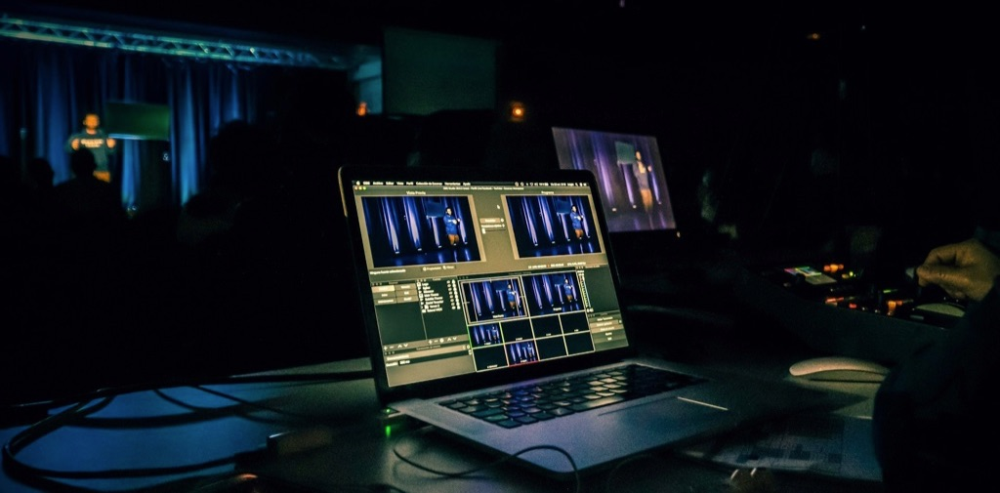

# Content production



<details open markdown="block">
  <summary>
    Table of contents
  </summary>
  {: .text-delta }
1. TOC
{:toc}
</details>

---

<!--
- add more feature images for sections towards the end
- add more info to writing (or refer to the draft)
- raw vs compressed files
- presentation with PP, Google Slides or Prezi 
- working on mobile (vs laptop)
- app: NameChanger
- web: Cyberduck, vis.js
- colour combinations
-->


Content producers can be responsible for [multiple stages of their projects](project-management):

1. Defining or refining goals
2. Drafting narratives, ideas, and suitable workflows
3. Developing the content by:
   - Conducting further literature reviews
   - Analyzing findings
   - Synthesizing findings using:
     - Text
     - Still images
     - Audio
     - Moving images
4. Seeking feedback from peers and professionals
5. Contextualizing, publishing, or disseminating the final product

This page outlines materials and tools used for **synthesizing findings**. Your content can use a [combination of these materials](https://directorsnotes.com/2022/09/28/emma-miranda-moore-run/) and even make some [interactive](https://bcmi.khofstadter.com/timeline/).

## Materials to take or make?


Where to get these materials from?

- Take them from others (free or paid)
- Make them yourself (DIY)

Free and paid materials can have different requirements regarding:
- Commercial or non-commercial use
- Attribution (credit the author or not)
- Repurposing (allowed amend the source material or not)

Examples of stock libraries that list materials:
- Free and paid materials (e.g., [Unsplash](https://unsplash.com/images))
- Only paid materials (e.g., [Envato](https://elements.envato.com))
- Only free materials (e.g., [Freesound Project](https://freesound.org/))

Examples of free image use can be found on this website. Although it is often not required, I give credit to authors as I appreciate when [my photos are credited](http://www.ludions.com/projects/lichens/) as well. 

For more detailed information on using free materials, visit:
- [creativecommons.org](https://creativecommons.org/)
- [differencebetween.net](http://www.differencebetween.net/business/difference-between-creative-commons-and-public-domain/)

To create your own materials, you have two options:

1. Modify existing resources: You can often repurpose, reuse, or amend freely available materials. For example, I repurposed vector graphics for a [poster](https://khofstadter.com/c/) and used a sound recording of people playing in the sea for a [music release](https://tedor.bandcamp.com/album/swimming).

2. Start from scratch: Alternatively, you can begin with a blank canvas and create everything yourself. For instance, I created both the cover art and music from scratch for an music release called [Flow](https://tedor.bandcamp.com/album/flow-in-metamorphosis). 

## Materials


### Text
  - [prose](https://sociable.co/government-and-policy/how-globalists-governments-digital-id-climate-covid-cybersecurity-cbdc/)
  - [quotes](https://www.goodreads.com/quotes/tag/hermann-hesse)
  - [poetry](https://writeme.ai/poetry/)
  - computer code e.g. 

```
if ( students.progress == true ) {
    teacher.happiness = true
}
else {
    teacher.happiness = false
}
```

Consider using language tools to support your writing (e.g., LanguageTool, Grammarly, Hemingway App, ProWritingAid or ChatGPT). Compare their prices and features as well as consider how they can be added and improve to your current workflow. 

Don't overuse AI, otherwise you will depend on it.

*Would you like me to demonstrate how I write with my tools in one of the remaining weeks?*

### Still image
Types:
- [photography](https://unsplash.com/)
- [computer graphics](https://www.vectorstock.com/free-vectors)
- diagrams (e.g., made with [Inkscape](https://inkscape.org/), [RAWGraphs](https://www.rawgraphs.io/), [Mermaid](https://mermaid.js.org))
- [paintings](https://museo.app/)

They could be used for:
- logos and [favicons](https://favicon.io/)
- feature images to go in a [blog post grid](https://enhancingaudiodescription.com)
- header images at the top of a page
- images between text
- videos (moving images)

An example of computer graphics (could have vectors or pixels): 


An example of a photo:


Highlighting the difference between vector and pixel graphics: 


Some key points about still images:
- Pixels can often provide more depth and detail.
- Vector graphics are better for scaling, such as for logos.
- Remember to check the required attributions and how you can use or repurpose the image.
- Also consider asking people on different platforms like [Flickr](https://www.flickr.com) or [Behance](https://www.behance.net) for images instead of relying solely on free images from stock libraries. It's good to connect to other creators. [I did](https://tedor.bandcamp.com).

Tools for working with pixels:
> "The best camera is the one you have."

Is this quote true? What does it mean?

- Consider light and composition first. You can find more tips [here](https://www.lightstalking.com/best-camera-one-with-you/).
- If possible, shoot in RAW format to allow room for editing, even on your phone.
- You can do serious work with [GIMP](https://www.gimp.org/), a free alternative to [Photoshop](https://www.adobe.com/uk/products/photoshop.html). Search for "Photoshop alternatives" for more options.

Tools for working with vectors:
- You can do serious work with [Inkscape](https://inkscape.org/), a free alternative to [Illustrator](https://www.adobe.com/uk/products/illustrator.html). Search for "Illustrator alternatives" for more options.

If you need to convert pixel-based images to vectors, try [vectorizer.ai](https://vectorizer.ai/).

*How could your website benefit from still images?*

### Audio
Types (filmmaker's classification):

- sound effects (e.g. footsteps, door, gunshots, sound of robots)
- background ambience (AKA atmosphere) (e.g. birds and wind in a park, traffic, machines and humans working together in a factory)
- dialogue and voiceover (e.g. spoken monologue, conversation, narration, or commentary)
- music

They can be recorded (with a microphone) or synthesized with machines (analog or digital).

Free audio stock libraries:
- [https://freesound.org/](https://freesound.org/)
- [https://mixkit.co/free-sound-effects/](https://mixkit.co/free-sound-effects/)
- [https://www.silvermansound.com/free-music](https://www.silvermansound.com/free-music)

Audio could be used in:
- podcasts
- music
- to support images (still or moving)

Tools for making audio:
- For quality recordings, use a condenser mic (not a dynamic mic). Condenser mics are for studios, while dynamic mics are for live performances.
- Isolate noises when recording as much as possible (unless they are part of your story), e.g., by using a soundproof studio or windshields and boom poles or stands when working outside.
- Record in high sample rate, not in compressed formats (e.g. WAV instead of mp3).
- Try to use quality headphones/speakers (called monitors) when editing audio.
- The [Zoom H1n](https://zoomcorp.com/en/gb/handheld-recorders/handheld-recorders/h1n-handy-recorder/) is an entry-level portable microphone (you can buy a second-hand version of the earlier model on eBay for less than £50 or try borrowing one from your university's media center).

Production stages can involve:
1. pre-production: discussions, drafting ideas
2. production: recording, sound design, music composition
3. post-production: editing, mixing, mastering

- Big productions have different people for each of these stages mentioned above, but the whole production can be done by one person too.
- Use a Digital Audio Workstation (DAW) (e.g., [Reaper](https://www.reaper.fm/), [Pro Tools](https://www.avid.com/pro-tools), [Logic Pro](https://apps.apple.com/gb/app/logic-pro/id634148309?mt=12), Audacity, Adobe Audition) for these stages.
- Sometimes specific software/hardware is used for specific stages (e.g., recording can be done with [portable recorders on SSD cards](https://www.zoom.co.jp/products/handy-recorder/h1-handy-recorder) or directly on the computer's HDD in a [studio](https://unsplash.com/s/photos/studio-recording)).
- Consider using mono, stereo, and perhaps surround or [binaural](https://www.soundonsound.com/techniques/introduction-binaural-recording) audio techniques. <!--0 Note that there is a difference between binaural audio recording and [binaural beats](https://duckduckgo.com/?q=binaural+beats&t=brave&ia=web).-->

*How could your website benefit from audio?*

### Moving image
Types: 
  - [film clips](https://www.pexels.com/search/videos/construction/) made with cameras
  - [animations](https://www.videvo.net/free-motion-graphics/) made with computers
  - [screencasts](https://youtu.be/6oTBMjbImHo?feature=shared) made with computers
  - [dynamic content](https://processing.org/examples) made with computer code

Can be used:
- to demonstrate the use of a specific software with basic a screencast recording
- archive an [interview or group discussion](https://youtu.be/JmOmwLWziAc?feature=shared) with specific software e.g. Zoom
- for storytelling with mixed material (e.g. [using sound design, music and narration, animation](https://www.youtube.com/c/theschooloflifetv/videos))
- for short documentaries or dramatized films

Production stages (similar to the audio production stages above)
1. pre-production (e.g. discussions, designing ideas, drawings, temp tracks)
2. production (e.g. shootings / graphics rendering / sound recording on sets)
3. post-production, editing (e.g. arrangement of clips, linking audio and visuals, foley recordings, color tuning, noise reduction, dubbing mix)

Tools
- to record films: smartphones, video cameras, webcams (choose according to project's needs)
- to make animations: I only used Flash 20 years ago, not sure, search!
- to record screencasts:  
  - [Screencast-O-Matic](https://screencast-o-matic.com/) (available on lab PCs)
    - [tutorial](https://www.youtube.com/watch?v=LAg4_eFITNc)
    - can't edit with the free version nor record computer audio but offers screen+webcam even without making an account
    - limited to 15 minutes
  - [Open Broadcaster Software](https://obsproject.com/)  (available on lab PCs)
    - [tutorial](https://youtu.be/QKmrDUJFRkM)
    - does not seem to be a good editing tool, but it's free and you can mix desktop + webcam and export in a variety of formats
  - on a Mac you can use [QuickTime](https://www.youtube.com/results?search_query=screencast+with+quicktime) as well
  - I've been using [Screenflow](https://www.telestream.net/screenflow/overview.htm) for years (not free)
- edit videos: [Premier](https://www.adobe.com/uk/products/premiere.html), [iMovie](https://www.apple.com/uk/imovie/), [Final Cut Pro](https://www.apple.com/uk/final-cut-pro/), [DaVinci Resolve](https://www.blackmagicdesign.com/products/davinciresolve/), [OpenShot](https://www.openshot.org/),   
- to record and edit audio: same as above in the audio heading
  - most video editing software provide you with good audio editing functions
  - but, you can export the audio from the final video and edit/mix/master in a software specialized for audio work (e.g Reaper DAW)

## Final thoughts
Before you choose a tool to experiment with, compare alternatives (e.g. search for '[Illustrator alternatives + year](https://www.google.co.uk/search?q=illustrator+alternatives+2023&client=safari&sca_esv=579127353&source=hp&ei=c9REZcysCZyDhbIPi4SM2A4&iflsig=AO6bgOgAAAAAZUTig8Wv3X70U_I-Q-jk9PxCTY5rFyVy&ved=0ahUKEwiMsuiV2KeCAxWcQUEAHQsCA-sQ4dUDCAs&uact=5&oq=illustrator+alternatives+2023&gs_lp=Egdnd3Mtd2l6Ih1pbGx1c3RyYXRvciBhbHRlcm5hdGl2ZXMgMjAyMzIGEAAYFhgeMggQABiKBRiGAzIIEAAYigUYhgMyCBAAGIoFGIYDSMIxUJ8GWN0ucAF4AJABAJgBTKABiw2qAQIyObgBA8gBAPgBAagCCsICEBAAGAMYjwEY5QIY6gIYjAPCAhAQLhgDGI8BGOUCGOoCGIwDwgILEAAYgAQYsQMYgwHCAhEQLhiABBixAxiDARjHARjRA8ICBRAuGIAEwgILEC4YgAQYsQMYgwHCAgUQABiABMICCxAAGIoFGLEDGIMBwgIIEC4YgAQYsQPCAhEQLhiABBixAxiDARjHARivAcICCBAAGIAEGLEDwgIHEC4YgAQYCsICDhAuGIAEGLEDGIMBGNQCwgINEAAYFhgeGA8Y8QQYCg&sclient=gws-wiz)') and consider:

  - does this tool have good tutorials?
  - does it have an active community for support (e.g, is there a forum where I can post questions)? 
  - are there examples that I can take apart?
  - are there examples of finished projects similar to what I want to do?
  - paid software is often more user-friendly than free software and it is possible that it has fewer bugs and a quick customer support team 
  - paid has trial versions (some with watermarks or expiry dates)

Use it or lose it! If you don't use a software for a while, you will forget how it works. Try to work with your final choice regularly. <!-- link this to old people's brains, my pain in my feet -->

Record your assets (audio, still and moving images) in high definition.

Making screen recordings where you are talking can take ages:
  - write a script and rehearse
  - consider the advantages and disadvantages of recording your face or not (editing without seeing your mouth moving is easier)

Whether to do all tasks or delegating some, often depends on your budget and deadlines, but this should primarily depend on what tools you enjoy working with and need to work with in the future. 

Less is (often) more (e.g. simple transitions in video editing), especially if your raw materials are good. Focus on the essentials, not on glitter. 

Organize your assets for one project in one folder (e.g. audio/video/text files) and fine-tune a system that you can oversee your projects with ease (e.g. be consistent with your folder and file naming.)

*What are the pros and cons of taking or making materials?*

To help you choose, think about these quotes: 

> "There are things in the book you could never do in a movie." - Noah Hathaway

> "A picture is worth a thousand words." - Anonymous

> "The sound and music are 50% of the entertainment in a movie." - George Lucas

[Seth's article](https://seths.blog/2022/03/outsourcing/) can also help. 

<!-- need a good quote for audio only -->

## Further resources
- [Lorem Ipsum](https://www.lipsum.com/), a random text generator
- [British National Corpus](http://www.natcorp.ox.ac.uk/)
- [Sketchengine](https://app.sketchengine.eu/)
- [logosbynick.com](https://logosbynick.com/graphic-design-computer-requirements-2021/)
- [ImageOptim](https://imageoptim.com/mac)
- [diagrams.net](https://www.diagrams.net/)
- [AI Image Description](https://www.astica.org/vision/describe/) - could be used for Alt texts
- [List of open source tools](https://awesomeopensource.com/)
- [Podcast Blog](https://www.podcastengineers.com/blogs/)

## Image credits
Header photo by <a href="https://unsplash.com/@reskp?utm_content=creditCopyText&utm_medium=referral&utm_source=unsplash">Jametlene Reskp</a> on <a href="https://unsplash.com/photos/black-laptop-computer-turned-on-on-table-HJljK-svzBQ?utm_content=creditCopyText&utm_medium=referral&utm_source=unsplash">Unsplash</a>.
  

Photo of man looking for materials in a DIY shop by <a href="https://unsplash.com/@oksdesign?utm_source=unsplash&utm_medium=referral&utm_content=creditCopyText">Oxana Melis</a> on <a href="https://unsplash.com/@oksdesign?utm_source=unsplash&utm_medium=referral&utm_content=creditCopyText">Unsplash</a>.

Photos in the collage by <a href="https://unsplash.com/@nate_dumlao?utm_source=unsplash&utm_medium=referral&utm_content=creditCopyText">Nathan Dumlao</a> and <a href="https://unsplash.com/@kellysikkema?utm_source=unsplash&utm_medium=referral&utm_content=creditCopyText">Kelly Sikkema</a> on <a href="https://unsplash.com/s/photos/buying?utm_source=unsplash&utm_medium=referral&utm_content=creditCopyText">Unsplash</a>.