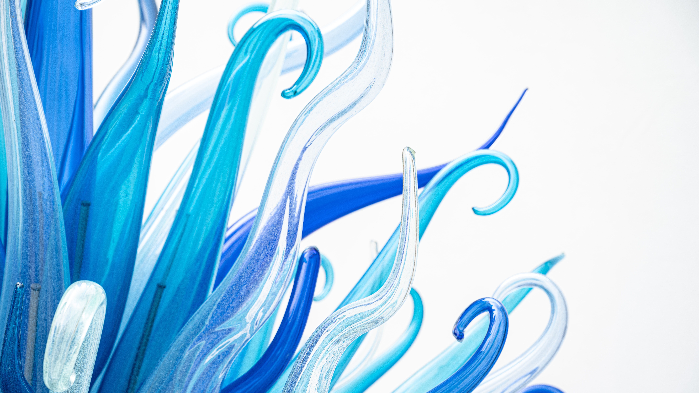

# Content production


<details open markdown="block">
  <summary>
    Table of contents
  </summary>
  {: .text-delta }
1. TOC
{:toc}
</details>

---

<!--
- add more feature images for sections towards the end
- add more info to writing (or refer to the draft)
- raw vs compressed files
- presentation with PP, Google Slides or Prezi 
- working on mobile (vs laptop)
- app: NameChanger
- web: Cyberduck, vis.js
- colour combinations
-->


As a content producer for our websites, we could be responsible for several stages of our projects:

1. Defining or refining goals
2. Drafting narratives, ideas, and suitable workflows
3. Developing the content by:
   - Conducting further literature reviews
   - Analyzing findings
   - Synthesizing findings using:
     - Text
     - Still images
     - Audio
     - Moving images
4. Seeking feedback from peers and professionals
5. Contextualizing, publishing, or disseminating the final product

This page outlines materials and tools used for synthesizing findings. Your content can use a [combination of these materials](https://directorsnotes.com/2022/09/28/emma-miranda-moore-run/) and even make some [interactive](https://bcmi.khofstadter.com/timeline/).

## Material to Take or Make?


Where to get these materials from?

- Take them (free or paid)
- Make them (DIY)

Free and paid materials can have different requirements regarding:
- Attribution (e.g., private/commercial use, whether you need to credit the author or not)
- Repurposing (e.g., whether you can amend the source material or not)

Some stock libraries that list materials include:
- Free and paid materials (e.g., [Unsplash](https://unsplash.com/images))
- Only paid materials (e.g., [Envato](https://studio.envato.com/))
- Only free materials (e.g., [Freesound Project](https://freesound.org/))

Examples of free image use can be found on this website. Although it is often not required, I give credit to authors as I appreciate when [my photos are credited](http://www.ludions.com/projects/lichens/) as well. 

For further information on using free materials, you can visit:
- [creativecommons.org](https://creativecommons.org/)
- [differencebetween.net](http://www.differencebetween.net/business/difference-between-creative-commons-and-public-domain/)

To make your own materials, you can:
- Often repurpose, reuse, or amend free materials. For example, I repurposed graphics for a [poster](https://khofstadter.com/c/) and used a sound recording of a pier with people playing in the sea for a [music release](https://tedor.bandcamp.com/album/swimming).
- Start from scratch. For instance, I created the cover art and music of [flow](https://tedor.bandcamp.com/album/flow-in-metamorphosis).

## Materials


### Text
  - [prose](https://sociable.co/government-and-policy/how-globalists-governments-digital-id-climate-covid-cybersecurity-cbdc/)
  - [quotes](https://www.goodreads.com/quotes/tag/hermann-hesse)
  - [poetry](https://writeme.ai/poetry/)
  - computer code e.g. 

```
if ( students.progress == true ) {
    teacher.happiness = true
}
else {
    teacher.happiness = false
}
```

Consider using language tools to support your writing (e.g., LanguageTool, Grammarly, Hemingway App, ProWritingAid or ChatGPT). Compare their prices and features as well as consider how they can be added and improve to your current workflow.

### Still Images
Types:
- [photography](https://unsplash.com/)
- [computer graphics](https://www.freepik.com/popular-vectors)
- diagrams (e.g., made with [Inkscape](https://inkscape.org/), [RAWGraphs](https://www.rawgraphs.io/), [Mermaid](https://mermaid.js.org))

They could be used for:
- logos and [favicons](https://favicon.io/)
- feature images to go in a blog post grid
- header images at the top of a page
- images between text
- videos (moving images)




Some key points about still images:
- Pixels can provide more depth and detail.
- Vector graphics are better for scaling, such as for logos.
- Remember to check the required attributions and how you can use or repurpose the image.
- Also consider asking people on different platforms like Flickr or Behance for images instead of relying solely on free images from stock libraries. It's good to connect to other creators.

Tools for working with pixels:
> "The best camera is the one you have."

- Consider light and composition first. You can find more tips [here](https://www.lightstalking.com/best-camera-one-with-you/).
- If possible, shoot in RAW format to allow room for editing, even on your phone.
- You can do serious work with [GIMP](https://www.gimp.org/), a free alternative to [Photoshop](https://www.adobe.com/uk/products/photoshop.html). Search for "Photoshop alternatives" for more options.

Tools for working with vectors:
- You can do serious work with [Inkscape](https://inkscape.org/), a free alternative to [Illustrator](https://www.adobe.com/uk/products/illustrator.html). Search for "Illustrator alternatives" for more options.

If you need to convert pixel-based images to vectors, you can try using this AI tool: [vectorizer.ai](https://vectorizer.ai/).

*How could your website benefit from still images?*


### Audio
Types:
  - [sound recordings](https://freesound.org/)
  - [sound effects](https://mixkit.co/free-sound-effects/)
  - [music](https://www.silvermansound.com/free-music)

Could be used in
  - podcasts
  - music
  - to support images (still or moving)

Tools for making:
- for quality recordings, use a condenser mic ([not a dynamic mic](https://duckduckgo.com/?q=condenser+vs+dynamic+mic))
- isolate noises when recording as much as possible (unless they are part of your story)
- record in high sample rate
- use quality headphones/speakers (called monitors) when editing audio
- Zoom H1, binaural mic, gooseneck, windshields

Production stages:
1. can involve recording/sound design/music composition
2. editing
3. mixing
4. mastering

- big productions have different people for each of these stages, but the whole production can be done by one person too
- stages can be done in one software, a Digital Audio Workstation (e.g. like [Reaper](https://www.reaper.fm/), [Pro Tools](https://www.avid.com/pro-tools), [Logic Pro](https://apps.apple.com/gb/app/logic-pro/id634148309?mt=12), Audacity, Adobe Audition)
- however, sometimes specific software/hardware is used for specific stages (e.g. recording can be done with [portable recorders on SSD cards](https://www.zoom.co.jp/products/handy-recorder/h1-handy-recorder) or straight on the computer's HDD in a [studio](https://unsplash.com/s/photos/studio-recording))
- consider panning mono, stereo and perhaps surround or [binaural](https://www.soundonsound.com/techniques/introduction-binaural-recording) audio techniques) – note, there is a difference between binaural audio recording and [binaural beats](https://duckduckgo.com/?q=binaural+beats&t=brave&ia=web))
    
*How could your website benefit from audio materials/content?*

### Moving image
Elements:
  - [films](https://www.pexels.com/search/videos/construction/) (movie clips) made with cameras
  - [computer generated animations](https://www.videvo.net/free-motion-graphics/)
  - dynamic content (e.g. [made with computer code](https://cs.nyu.edu/~kapp/cs101/processing_on_the_web/))
  - computer screen recordings (screencasts)
  - still images
  - audio
Can be used to make 
- simple interview or presentation recordings (e.g. [a lecture's archive](https://www.youtube.com/user/johnvervaeke/videos)
- storytelling with mixed material (e.g. [sound design, music and narration, graphic design](https://www.youtube.com/c/theschooloflifetv/videos))
- screencast (e.g. [demonstrating the use of a specific software](https://youtu.be/6oTBMjbImHo))
- short or feature film, animation (documentary or artistic/dramatized)

Production stages
- similar to the audio production stages above
1. pre-production (e.g. discussions, designing ideas, drawings, temp tracks)
1. production (e.g. shootings / graphics rendering / sound recording on sets)
2. post-production, editing (e.g. arrangement of clips, linking audio and visuals, foley, colour tuning, noise reduction, dubbing mix, etc.)

Tools for making:
to record films:
- smartphones, camcorders, video cameras, webcams (choose according to project's needs)
to create animations:
- search for '[compare animation software](https://duckduckgo.com/?q=compare+animation+software&t=brave&ia=web)' 
to record audio:
- inbuilt or external microphones (for better quality use external, condenser microphones)
to edit videos: 
- [Premier](https://www.adobe.com/uk/products/premiere.html), [iMovie](https://www.apple.com/uk/imovie/), [Final Cut Pro](https://www.apple.com/uk/final-cut-pro/), [DaVinci Resolve](https://www.blackmagicdesign.com/products/davinciresolve/), [OpenShot](https://www.openshot.org/),  
  - some available on lab PCs,  ... search for 'video editing software'
to edit audio:
- most video editing software provide you with good audio editing functions
- but, you can export the audio from the final video and edit/mix/master in a software specialised for audio work (e.g Reaper)
to make screencasts:  
- [Screencast-O-Matic](https://screencast-o-matic.com/) (available on lab PCs)
  - [tutorial](https://www.youtube.com/watch?v=LAg4_eFITNc)
  - can't edit with the free version nor record computer audio but offers screen+webcam even without making an account
  - limited to 15 minutes
- [Open Broadcaster Software](https://obsproject.com/)  (available on lab PCs)
  - [tutorial](https://youtu.be/QKmrDUJFRkM)
  - does not seem to be a good editing tool, but it's free and you can mix desktop + webcam and export in a variety of formats
- on a Mac you can use [QuickTime](https://www.youtube.com/results?search_query=screencast+with+quicktime) as well
- more? search for 'screencast software comparison'

## Final thoughts
- use it or loose it: If you don't use a software for a while, you will forget how things work, where things are. So, if you think you will use these software in years, try to work with them regularly. <!-- link this to old people's brains, my pain in my feet -->
- record in high definition if you have space 
- before you start working with a software, read many articles comparing alternatives
- as with photography, consider light and composition first
- I can demonstrate the use of software available on the lab PCs if needed (let me know!)
- making screenrecordings where you are talking can take ages!
  - rehearse the script
  - consider whether the advantages and disadvantages of your face (body) being recorded as well while talking (e.g. it might be difficult to edit)
    - sometimes you need to dub your own recording (e.g. [here](https://youtu.be/l8ymktV89YM?t=620) where I confused left with the right side)
- finishing something often takes longer than you expect
- use paid vs free software (e.g. some more free options [here](https://awesomeopensource.com/)). To consider:
  - does the software have good tutorials and a good community for support (e.g. via an established online forum)?
  - are there examples that I can take apart?
  - are there examples of work similar to what I want to do?
  - paid software is often more user-friendly than free software, and it is possible that it has fewer bugs
  - free you can often customize in more depth
  - paid has trial versions (some with watermark)
- do it all or delegate tasks (if you can)
- less is more (e.g. simple transitions in video editing), especially if your raw materials are good
- paid software often has a more satisfying user experience (UX)
- start with good raw materials (e.g. when collecting audio and video assets) to save time in post-production
- record raw files and archive them for later
- keep assets (e.g. audio/video/text files for one project together i.e. organized in one folder)
- have a convention for naming and organizing your files

*What are the pros and cons of taking or making materials?*

To help you choose, think about these quotes: 

> "There are things in the book you could never do in a movie." - Noah Hathaway

> "A picture is worth a thousand words." - Anonymous

> "The sound and music are 50% of the entertainment in a movie." - George Lucas

<!-- need a good quote for audio only -->

## Further resources
- [Lorem Ipsum](https://www.lipsum.com/), a random text generator
- [British National Corpus](http://www.natcorp.ox.ac.uk/)
- [Sketchengine](https://app.sketchengine.eu/)
- http://www.vectorss.com/
- take or make: https://seths.blog/2022/03/outsourcing/
- https://github.com/snmslavk/awesome-jekyll-websites
- [logosbynick.com](https://logosbynick.com/graphic-design-computer-requirements-2021/)
- [ImageOptim](https://imageoptim.com/mac)
- [diagrams.net](https://www.diagrams.net/)
- [Gimp vs Inkscape](https://thegimptutorials.com/gimp-vs-inkscape/) (pixels vs vectors)
- [AI Image Description](https://www.astica.org/vision/describe/) - could be used for Alt Tex

## Image credits
Header image was generated with Image Creator (DALL·E 3) on 2 November 15:54 pm using "An image where one person manages multiple parts of a creative project. The person is a busy human-octopus-robot cyborg. Tasks involve writing, music making, video making. NeeIn Kandinsky style."

Photo of man looking for materials in a DIY shop by <a href="https://unsplash.com/@oksdesign?utm_source=unsplash&utm_medium=referral&utm_content=creditCopyText">Oxana Melis</a> on <a href="https://unsplash.com/@oksdesign?utm_source=unsplash&utm_medium=referral&utm_content=creditCopyText">Unsplash</a>

Photos in the collage by <a href="https://unsplash.com/@nate_dumlao?utm_source=unsplash&utm_medium=referral&utm_content=creditCopyText">Nathan Dumlao</a> and <a href="https://unsplash.com/@kellysikkema?utm_source=unsplash&utm_medium=referral&utm_content=creditCopyText">Kelly Sikkema</a> on <a href="https://unsplash.com/s/photos/buying?utm_source=unsplash&utm_medium=referral&utm_content=creditCopyText">Unsplash</a><br>