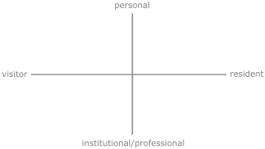

# Digital identities

{: .no_toc }

## Table of contents
{: .no_toc .text-delta }

1. TOC
{:toc}

---

<!--
## Generations

[overview video](https://youtu.be/TtIojDWOsgg) (9-min YouTube video)

- video is relevant to the Western world 
- the silent generation (traditionalists), b.1945
  - value hard work, don't like to be wasteful, respect authority/elders  
- baby boomers b.1946-64
  - link to counterculture e.g. hippies, started out to be liberal, became more conservative later
- gen X b.1965-79
  - both parents working, more peer-orientated, music helps define their identity
- gen Y (millennials) b.1980-95
  - more links to technology, more group-oriented (some say more selfish, entitled, lazy, etc.)
- gen Z (centennials) b.1996-present
  - relationship to technology depends on whether parents are gen X or gen Y
  - strong relationship to technology especially regarding communication with peers
  - most similarities to millennials
- gen Alpha (not covered in the video)
  - [search the Internet](https://duckduckgo.com/?q=gen+alpha&t=brave&ia=web)
-->

This page explores Dave White's concepts of digital identities as presented across three of his short videos. I used the following steps to reflect on his work:

1. Take brief notes while watching the videos (only keywords and key ideas), don't pause the video. 
2. Refine your notes (perhaps watch again and pause if necessary):
   - Integrate your new knowledge into your old knowledge (make connections between what you've learned now and what you already knew).
   - Write full sentences and use your own writing style, your own vocabulary as much as possible. Personalize it.
   - Ask questions where something is unclear (e.g. a connection between ideas is missing).
3. Refine your notes, consider [paraphrasing quotes](https://quillbot.com/), and [grammar check](https://quillbot.com/grammar-check) for readability - make sure they make sense, and ideally not just for you. Use an AI language model for quick feedback (e.g. [ChatGPT](https://chat.openai.com/)).

## Visitors and residents
> Visitors and Residents is a simple way of describing the range of ways individuals can engage with the Web. ~ Dave White 

### 1. Introduction

      <iframe src="https://www.youtube.com/embed/sPOG3iThmRI?si=ClmZRfck04MoAogj" title="YouTube video player" frameborder="0" 
              allow="accelerometer; autoplay; clipboard-write; encrypted-media; gyroscope; picture-in-picture; web-share" allowfullscreen></iframe>
   

- The VR map can help understand our engagement with technology more accurately than [Marc Prensky](https://www.marcprensky.com/)'s Digital Natives and Digital Immigrants method.
- The VR method uses a 2D coordinate system to quantify our engagement with the Web.

<strong>Figure 1. </strong> VR map.

- The VR map helps all ages (not just old people) and people with low technical skills to use the Web efficiently.
- It is based on people's motivation to engage with the Web and has two modes: visitor and resident modes, and is further refined by whether we engage in an activity in a personal or an institutional (professional) manner.
- Visitor modes:
  - Activities where **we don't leave a social trace behind** (e.g. searching/reading information on the Web, watching videos, shopping, paying our bills). But, remember that search engines could store your search history and website cookies can crawl data from you even in your visiting modes.
- Resident modes:
  - Activities where we are present with other people and **leave a social trace behind**. A footprint of our activities stays online after we leave the internet (e.g. by creating content or commenting on other people's content on online platforms [websites, social media]). As these activities are public, they can be linked to our (digital) identities, and therefore we should be careful when we use the Web in this mode. (We should be careful when we use our visitor modes as well, of course!)
- An example of personal engagement is using social media or emails to communicate with friends and family about personal matters.
- An example of institutional activities is disseminating or discussing ideas as a worker or a student in higher education (HE) online (or print).
- [VR map examples](http://daveowhite.com/vandr/vr-mapping/)

#### Discussion
- *Where do you feel most of your activity is on the VR map?*
- *How much time do you think it would take to write up the list of notes above into prose (e.g. as an essay's paragraph)?*

### 2. Credibility

      <iframe src="https://www.youtube.com/embed/kO569eknM6U?si=AwixeRR80GqJiqzx" title="YouTube video player" frameborder="0" 
              allow="accelerometer; autoplay; clipboard-write; encrypted-media; gyroscope; picture-in-picture; web-share" allowfullscreen></iframe>
   

- Before the Web, institutionally reviewed resources were made available on paper, which, as this was expensive, meant that only experts could publish.
- In contrast, the Web more recently provides an inexpensive method to share information with a potentially large audience without the institutional gatekeepers.

> In the only environment where curation is by algorithm and not by librarian, convenience and relevance often outstrip traditional notions of credibility and authority. The Web brings into question what it means for a source of information to be legitimate, and it highlights the trust we place in the form and provenance of those sources.

- Traditional information (e.g., books) and information on the Web (e.g., a blog post) use different methods to gain attention and credibility:
  - Traditional (established): Validated by established institutions e.g., universities, publishing houses, and know experts (promoted by institutions, 'the gatekeepers').
  - Web (new/emerging): Brought to our attention ('validated') by search engines, likes, followers, views, comments (promoted mainly by individuals).

- Using the Web to source information is convenient; however, it might not provide the most accurate information about a specific subject.

- Earlier, students published their first work after their PhDs. Today the Web allows us to start developing our professional identity before finishing our doctoral research e.g., by expressing our opinions about other people's work openly and publishing our own work on our websites or relevant platforms e.g., videos on [Vimeo](https://vimeo.com/), articles on [Medium](https://medium.com/), music on [SoundCloud](https://soundcloud.com/), photos on [Flickr](https://flickr.com/), graphic design on [Behance](https://www.behance.net/), software on GitHub, etc.

#### Discussion
- Should teachers in higher education be active online, for example, share their teaching resources on the Web and engage with learners who did not formally enroll in a module?
- What is the future of education? What do students get for paying their high fees?
- Shall students' learning rely entirely on the processes of formal education, such as lectures/workshops primarily using established forms of resources (e.g., academic journals) and assignments (e.g., essays or portfolios)? Or should their learning be more agile and incorporate the use of information on the Web (e.g., blog articles) and feedback on their works outside their workshops, i.e., should they seek feedback from people on discipline-related forums?
- Should we expect students to know how to use professional identities in resident modes efficiently? Probably not, but **they should be encouraged** to develop this practice.

### 3. Open Practice

      <iframe src="https://www.youtube.com/embed/1X0g2OvSdWc?si=WOM6OAT0UKF3npI3" title="YouTube video player" frameborder="0" 
              allow="accelerometer; autoplay; clipboard-write; encrypted-media; gyroscope; picture-in-picture; web-share" allowfullscreen></iframe>
   

- Students are comfortable sharing information about their personal lives online but less comfortable sharing information about their developing professional practices, "especially if this might open them up to criticism or reveal mistakes and failings."
- The audience of traditional publishing is:
  - Targeted, meaning that if you publish in a journal on biology, you will primarily have biologists reading your work.
  - Usually at a safe distance, meaning that if they criticize your work, they will do it in writing in a paper they publish (unless you present at a conference - some people can be harsh).
- The audience when publishing on the Web:
  - Could be unlimited (but is often targeted).
  - Can give you quick feedback linked to their real or not real identities.
- It might be better to consider work published online as unfinished, something that can start discussions. <!-- find webpages with version numbers or on the top some disclaimers saying this is an updated version of something earlier -->
- A powerful feature of open practice using the Web is the access to feedback from individuals or networks who are beyond the classroom. (Of course, you need to remain critical.)
- White believes "that making the process of learning more visible and collaborative online challenges students to become relevant members of their discipline or academic community" (although does not suggest this for all subjects).
- Students should have their own private groups where they can express themselves without being afraid of being monitored.
- Our main resident identities on the Web should probably not be a mix of personal and professional/institutional (hint: be personal in private groups and professional openly).

> All criticism is a form of autobiography. (Oscar Wilde)

*What does this quote mean in the context of commenting online?*

#### Discussion
- How could someone's professional identity be linked to their private life?
- Should students start sharing information about their practice/research after finishing their degrees or before? Is it possible to submit work for a uni assignment that you published somewhere online?
- Could some of you set up a forum where you can openly discuss ideas/issues which are not monitored by me or the university? Which social media apps do you use?
- How can you continue the sentence "As education moves towards incorporating the use of the Web, ..."?

## Summary
- It's not just old people who need to learn how to use the Web. Our engagement with the Web is complex.
- We need to be careful with the information we engage with online as it leaves a digital footprint. For example, your drunk videos might stay on Facebook forever.
- It's a good idea to start working on our professional (institutional) identity while studying in higher education, but we should make sure that we are comfortable with where and how much of our ideas/questions are shared publicly. Learn to use both private and public note-taking/publishing tools.

## Additional discussion
- What do you know about data mining?
- Do I know how Tech Giants (e.g., Google and Facebook) use my data?
- What is our digital footprint?
- Have you tried privacy-focused internet browsers to see what information certain websites are trying to access from your computer?

## Further resources
Anderson, J. and Rainie, L. (2014) **Digital Life in 2025**. Experts predict the Internet will become ‘like electricity’ — less visible, yet more deeply embedded in people’s lives for good and ill. Article available online at [Pew Research Centre](https://www.pewresearch.org/internet/2014/03/11/digital-life-in-2025/).

Autodidacts (2022) **My strategies for using technology without being used by it**. Blogpost available at [autodidacts.io](https://www.autodidacts.io/intentional-computing/).

BBC Learn and Revise (n.d.) **Millennials, baby boomers or Gen Z**. Which one are you and what does it mean? Article available at [BBC](https://www.bbc.co.uk/bitesize/articles/zf8j92p).

Boereem L. (2021) Moloch: The Beauty Wars. Beauty is getting weird right now. Thanks to technology, you can transform the ugliest photo into pure glamour in one click. But is this good for us? Will it make us happier and sexier, or will life become a soup of Kimface avatars and suicidal teenagers? This video is part one of a series on game theory and civilization. It centers around a character called Moloch: the god of war and competition-gone-wrong. The bad guy of humanity’s evolutionary story that we have to figure out how to defeat. The video is available on [YouTube](https://youtu.be/fifVuhgvQQ8) (15-min).

Coupland, D., Cowan, J. and Law, G. (n.d.) **Close Personal Friend**. An art-film exploring how the use of technology changes culture in the early 1990s. Video available on [YouTube](https://www.youtube.com/watch?v=Bg3a5f107Jc) (25-min).

Firefox Monitor. (n.d.) See if you’ve been part of an online data breach. Tool available at [firefox.com](https://monitor.firefox.com/).

Herzog, W. (2016) **Lo and Behold**, Reveries of the Connected World. An exploration of the Internet and the connected world. More info and trailer on [IMDB](https://www.imdb.com/title/tt5275828). Available on [Kanopy](https://www.kanopy.com/).

Kim, A. (2020) **What makes Asia−Pacific’s Generation Z different?** Article available on [McKinsey and Company](https://www.mckinsey.com/capabilities/growth-marketing-and-sales/our-insights/what-makes-asia-pacifics-generation-z-different)

Morse, J. (2019) **It’s a mistake to think that our online and IRL (in real life) lives are separate.** There is no longer a distinction between our online and offline selves. But that can change. Article available online at [Mashable](https://mashable.com/article/what-you-do-online-impacts-your-real-life?europe=true).

Orlowski, J. et al. (2020) **The Social Dilemma.** The documentary film provides a deep dive into how social media's design nurtures an addiction, manipulates people's views, emotions and behavior, and spreads conspiracy theories and disinformation, to maximize profit. Available on Netflix. More info on the project [website](https://www.thesocialdilemma.com/). An interview with the maker on Rebel Wisdom available of [YouTube](https://youtu.be/7EbPIdyd3I0).

Prensky, M. (2001) **Digital Natives, Digital Immigrants Part I and II.** Articles available at [marcprensky.com](http://marcprenskyarchive.com/writings/).

Stosney, S. (2014) **What's Wrong with Criticism.** How to ruin a perfectly good relationship. Available online at [Psychology Today](https://www.psychologytoday.com/us/blog/anger-in-the-age-entitlement/201404/whats-wrong-criticism).

The Infographic Show, (2018) **Millennials vs Generation Z**. How Do They Compare & What's the Difference? Video available on [YouTube](https://youtu.be/aqdm6aBUZII) (6-min).

White, D.S. and Corun, A. L. (2011) **Visitors and Residents: A new typology for online engagement**. This article proposes a continuum of ‘Visitors’ and ‘Residents’ as a replacement for Prensky’s much criticized Digital Natives and Digital Immigrants. Article available online at [First Monday](https://firstmonday.org/ojs/index.php/fm/article/view/3171). 

VPN Mentor, (n.d) **Who Is Really Watching?** From our locations and home addresses to private messages and phone numbers - we give away precious private information to online services everyday without even realizing it. We’ve deep dived into the privacy policies of some of the biggest companies online to uncover what they’re really tracking – use our tool to uncover who’s really watching you. Tool available at [vpnmentor.com](https://www.vpnmentor.com/research/whos-watching-you/#/?filter=thirdParty).