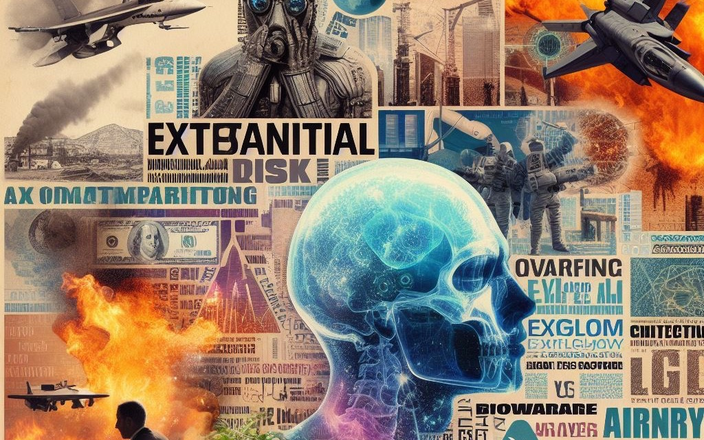

# Existential Risks

{: .no_toc }

## Table of contents
{: .no_toc .text-delta }

1. TOC
{:toc}

---

## Literature
Haselby, Sam 2023 **The polycrisis: Is this the word we need to describe unprecedented convergences between ecological, political and economic strife?** Essay available on [AEON](https://aeon.co/essays/the-case-for-polycrisis-as-a-keyword-of-our-interconnected-times?utm_source=pocket-newtab-en-gb). After discussing definitions of the word 'polycrisis', the essay states that the polycrisis is created by our words being interconnected and interdependent. Then it highlights how difficult it is to trust words; it says "word and wanton". (This is true as often researchers in the same academic environment don't use terms consistently, which can be frustrating to students, or anyone doing literature review. I wrote about this problem in my [PhD thesis](https://www.researchgate.net/publication/368365376_Developing_Brain-Computer_Music_Interfaces_for_Meditation) related to the field of brain-computer music interfacing.) Towards the middle of the article, Sam finally starts defining what we should define as **the** policrisis with examples linked to CO2, global human-made mass, wild mammals and extinction rate levels. Towards the end he also used the words 'quick' (pandemic, war) and 'slow' (climate change) to classify a crisis. The emphasis of the article is on urgency, that the crisis together need our urgent attention. 

Schmachtenberger, Daniel 2023 **An introduction to the Metacrisis** at Stockholm Impact Week 2023. Video available on [YouTube](https://youtu.be/4kBoLVvoqVY?feature=shared). Daniel talks about ther metacrisis, AI, the effects of globalization after WWII, and more. His message is depressing, but he is perfectly fine with it. He wants you to start by feeling depressed. Not feeling depressed means you haven't recognized the "continued destruction of the sacred around us" (e.g., sex trafficking of children or factory farming of animals). He offers a silver lining: Don't wait for others to address issues; take action yourself, which will alleviate your depression. I think he used the "f" word only five times.

*How is the polycrisis linked to the metacrisis?*

More to come ... 

## Image credits
Header image was generated with AI by krishofstadter on 12 October 2023 at 10:29 pm using "make an image collage with existential risks e.g. climate change, AI, biowarfare".