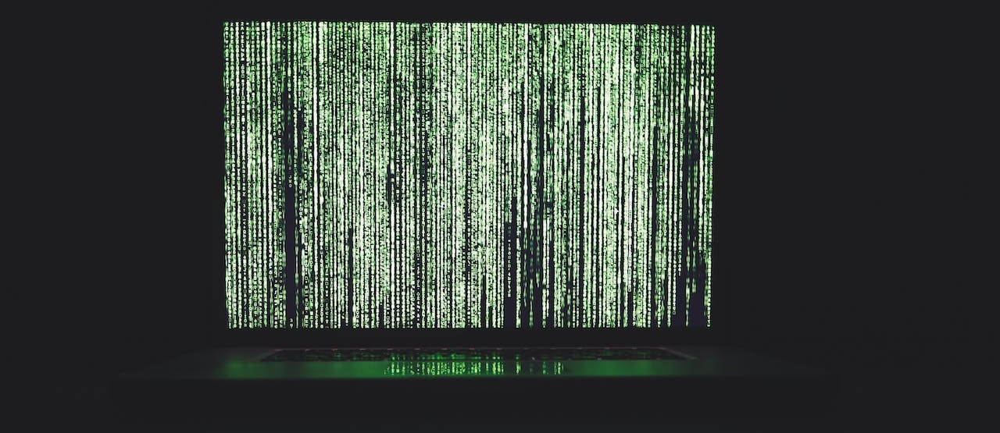

# The Physical–Digital World

Last update: Jan 2024

{{page.description}}

## Table of contents
{: .no_toc .text-delta }

1. TOC
{:toc}

---

## Introduction

In today's world, we are surrounded by digital technology in almost every aspect of our lives. From smartphones to laptops, from social media to online banking, from remote working to e-learning – digital technology has become an integral part of our daily routines. 

What exactly makes up this 'digital world'? 

What is its physical essence?

When we talk about the 'digital world', it's easy to imagine it as a sort of otherworldly, virtual dimension that exists separately from our physical reality. However, the truth is far from this. 

The digital world is deeply rooted in the physical world. It is built on tangible, material infrastructure, linking machines (computers) between
  1. data and server centers (which provide service) and 
  2. client computers (which access service) with 
  3. different types of wired and wireless connections

Understanding the physicality of the digital world can help understand  
- how data travels
- how devices communicate
- how the internet works
- how our actions in the real-world can have have consequences in the digital world (or the other way around)
- how our digital activities impact the environmental
- the geopolitics of internet access
- the societal implications of digital technologies

This page briefly outlines 
1. types of human communication
2. the history of the internet
3. the physical components that make up the digital world

The page should set the stage for the [rest of the presentations](cs220/cs220sp#syllabus-outline) in this module, each of which will delve deeper into specific aspects of our digital lives.

  

## Human Communication

The table below provides an overview of various communication methods along with their characteristics. It classifies each method based on the type of communication (mental, physical, digital, analogue), whether it's verbal or non-verbal, the mode of communication (in-person, remote), and the direction of communication (one-way, two-way, mass communication).

| Examples | Type | Verbal/Non-Verbal | Communication Mode | Communication Direction |
| --- | --- | --- | --- | --- |
| Conversation in a Cafe | Physical | Both | In Person (real-time) | Two-way (Interpersonal) |
| Self-talk | Mental | Both | In Person (real-time) | One-way (Intrapersonal) |
| Journaling | Physical/Digital | Verbal | In Person (real-time) | One-way (Intrapersonal)[^archetypes] |
| Mail/Email | Physical/Digital | Verbal | Remote (non-real-time) | Two-way (Interpersonal) |
| Print Media (Books, Newspapers) | Physical | Verbal | Remote (non-real-time) | Mass Communication |
| Television | Analogue/Digital | Both | Remote (real-time) | Mass Communication |
| Radio | Analogue/Digital | Verbal | Remote (real-time) | Mass Communication |
| Telephone | Analogue/Digital | Verbal | Remote (real-time) | Two-way (Interpersonal) |
| Video Calls e.g. Skype, Zoom | Digital | Both | Remote (real-time) | Two-way (Interpersonal) |
| Social Media (Facebook, Twitter, Instagram) | Digital | Both | Remote (real-time)/Remote (non-real-time) | Mass Communication | 

[^archetypes]: Talking or writing to ourselves could be classified in different ways if we believe that our consciousness consist of different parts. Also, journaling can be non-verbal as well if we add drawings to our notes for example.

  

## Digits (bits)

The **digital world is created from digits** rather than analogue signals for several key reasons:

1. Precision and Accuracy: Digital data can be reproduced exactly, while analog data is subject to slight variations.

2. Noise Resistance: Digital signals are less susceptible to noise or interference compared to analogue signals. Even if a digital signal is corrupted, as long as the corruption is not too severe, the original data can still be accurately reconstructed.

3. Ease of Processing: Digital data can be easily processed and manipulated by computers and other digital devices.

4. Storage and Transmission: Digital data can be stored and transmitted more efficiently and securely than analog data. It's also easier to make multiple copies of digital data without losing quality.

<!-- I need to make sure we don't think all digit signals look like waves -->

12 (Decimal) = `1100` (Binary, 4-bit information)

| Binary digit (on/off) | Power of 2 | Calculation |
| ------------ | ---------- | ----------- |
| 1            | 2^3        | 1 * 2^3 = 8 |
| 1            | 2^2        | 1 * 2^2 = 4 |
| 0            | 2^1        | 0 * 2^1 = 0 |
| 0            | 2^0        | 0 * 2^0 = 0 |

8+4=12

 

39 (Decimal) = `100111` (Binary, 6-bit information)

| Binary digit (on/off) | Power of 2 | Calculation |
| ------------ | ---------- | ----------- |
| 1            | 2^5        | 1 * 2^5 = 32 |
| 0            | 2^4        | 0 * 2^4 = 0  |
| 0            | 2^3        | 0 * 2^3 = 0  |
| 1            | 2^2        | 1 * 2^2 = 4  |
| 1            | 2^1        | 1 * 2^1 = 2  |
| 1            | 2^0        | 1 * 2^0 = 1  |

32+4+2+1=39

 

But if your system uses 6-bit information (data), the binary digit for your number 12 (Decimal) would be different: 

12 (Decimal) = `001100` (Binary, 6-bit information)

| Binary digit (on/off) | Power of 2 | Calculation |
| --------------------- | ---------- | ----------- |
| 0                     | 2^5        | 0 * 2^5 = 0 |
| 0                     | 2^4        | 0 * 2^4 = 0 |
| 1                     | 2^3        | 1 * 2^3 = 8 |
| 1                     | 2^2        | 1 * 2^2 = 4 |
| 0                     | 2^1        | 0 * 2^1 = 0 |
| 0                     | 2^0        | 0 * 2^0 = 0 |

 

The digital world, in essence, is a vast ecosystem connecting technologies, platforms, and systems. At its core, this ecosystem is built upon **software** and **raw data**. Software, the set of instructions or programs that dictate how a computer should perform a task, and data, the valuable information that serves as input for these tasks, work hand-in-hand to shape the digital landscape as we know it.[^terms-interchange]

                        +--------------------------------+
                        |              Digital           |
                        |               World            |
                        +--------------------------------+
                              /       |      \           \
                             /        |       \           \
                            /         |        \            \
                           /          |         \            \
                          /           |          \            \
                         /            |           \            \
                        /             |            \             \
                       /              |             \              \
                      /               |              \              \
                     /                |               \               \
                    /                 |                \               \
          +---------------+     +--------------+    +-------------+   +-----------+
          |  Technologies  |     |   Platforms   |    |  Systems   |   | Raw Data  |
          +---------------+     +--------------+    +-------------+   +-----------+

[^terms-interchange]: It's important to note that terms such as 'technologies', 'platforms', and 'systems' can often be interchangeable and context-dependent. They may convey similar meanings in different scenarios. Therefore, refrain from viewing the aforementioned classification as an absolute one. For instance, Yes, software can be considered as data. In the broad context of computing, data is any piece of information that can be processed by a computer. Software, which consists of lines of code and instructions for the computer to follow, certainly fits this definition.

For instance, technologies like Artificial Intelligence (AI), Machine Learning (ML), and Blockchain have revolutionized various sectors from healthcare to finance. Platforms such as social media sites (like Facebook, Instagram, and Twitter), streaming services (like Netflix and Spotify), and e-commerce marketplaces (like Amazon and eBay) have changed the way we interact, consume content, and shop. Systems like cloud computing infrastructures and database management systems are integral parts of businesses and organizations.

One of the most significant aspects of the digital world is the Internet. The Internet is not just a part of the digital world; it has become its backbone. It serves as a global platform for exchanging digital information, provides cloud-based solutions, connects digital devices around the world, and even enables everyday objects to exchange data through the Internet of Things (IoT).

 

## History of the Internet

Understanding the history of the Internet can provide us with valuable insights into how it has grown to become the technology that it is today.

### Early Beginnings

The story of the internet begins in the late 1960s with the creation of **ARPANET (Advanced Research Projects Agency Network)** by the U.S. Department of Defense. ARPANET was the first network to implement the TCP protocol, which became the technical foundation of the modern internet. <!-- what other protocols are there since then? -->

- **TCP (Transmission Control Protocol)** takes messages from an server/client and divides them into packets, which can then be forwarded by the devices in the network.

### Birth of the World Wide Web

The next significant milestone came in 1989 when a British computer scientist named Tim Berners-Lee proposed a system that made the internet more accessible and useful. He called this system the **World Wide Web (WWW)**. It was a revolutionary development that allowed documents and pages to be linked using [hyperlinks](https://www.w3schools.com/html/html_links.asp).

### Growth and Expansion

Throughout the 1990s and early 2000s, the internet saw exponential growth. The advent of web browsers such as Netscape Navigator and Microsoft's Internet Explorer made navigating the WWW easier for everyday users. This period also saw the rise of search engines like Google, which made finding information on the rapidly expanding web much simpler.

### The Modern Internet

Today, the internet continues to evolve at a rapid pace. With advancements in cloud computing, the Internet of Things (IoT), and artificial intelligence, our world is becoming increasingly connected. We now live in an era where we can access information, communicate with people across the globe, and perform countless tasks online, all thanks to the internet. <!-- Flag that there are threats as well. -->

More information can be found on [https://internethistory.org/](https://internethistory.org/) e.g. infographics like the figure below. 

### The Structure of The Modern Internet

The internet today works through a massive global network of optical fiber cables. In this animation, you can see how data typically flows between the different levels of Internet Service Providers (ISPs) in the modern internet. The optical fiber cables carry signals in the form of light. However, your laptop or mobile phone processes electrical signals. So how does this conversion of light to electrical signals happen? And more importantly, why is the internet structured the way it is today?

<iframe width="100%" height="315" src="https://www.youtube.com/embed/p5mASvEvDZc?si=oDNtVSetKle8sL_N" title="YouTube video player" frameborder="0" allow="accelerometer; autoplay; clipboard-write; encrypted-media; gyroscope; picture-in-picture; web-share" allowfullscreen></iframe>

Some interesting archives can be found [on this fun website](https://neal.fun/internet-artifacts/).

 

## Emerging Questions?

### What distinguishes hardware from software?

Hardware refers to the physical components of a computer system (e.g., the CPU, memory, and storage devices). Software, on the other hand, refers to the programs that run on the hardware, instructing it to perform certain tasks. All software is digital.

### How is data connected to software?

Data serves as the lifeblood of software. It can be generated or inputted by users, or it can be accessed from external sources such as databases or other services. I often refer to this concept as 'make or take'. When we 'make' data, we are creating and inputting our own data into the software. On the other hand, when we 'take' data, we are accessing and using data that has been created by others. Regardless of its origin, data provides the necessary information that software needs to perform its functions.

### How does the Internet connect servers and clients?

The Internet, facilitated by ISPs like Virgin Media, AOL, or Sky, acts as a global highway, connecting data centers (servers) and clients (our devices). These connections can be established through various wired or wireless technologies with different communication protocols. 

https://www.submarinecablemap.com/

### Do servers (data centers) have data and software?

Servers, which are connected to your device via ISPs, store and manage vast amounts of data, while clients request and use this data. But, these servers not only store data, they often store software that people can use remotely via their client computers.

### What is the client-side and the server-side of a software?

Facebook, for example, is a software application that runs on numerous servers in various data centers around the world. These servers are accessible because of the infrastructure provided by ISPs. When you access Facebook from your device (e.g., computer, smartphone), you're interacting with the client-side interface of the software, while the bulk of the processing happens server-side.

Example: When you post a status update on Facebook, the text of your post (data) is sent to Facebook's servers where it's processed and stored. Other users can then interact with your post via their own devices (clients).

Similarly, ChatGPT (and most other AI models) run on servers rather than directly on your device. The model itself (software) and the data it uses to generate responses are stored and processed on these servers.

Example: When you ask ChatGPT a question, your query is sent to the server where the AI model processes it and generates a response. This response is then sent back to your device (the client).

So, in essence, many modern software applications, especially those based on the SaaS (Software as a Service) model, operate by running the software on a server and allowing users to interact with it through clients on their own devices.

### What are Protocols?
The communication between servers and clients is governed by protocols, which are sets of rules that determine how data is transmitted over the internet. Protocols ensure that data packets are sent and received correctly, and they help maintain the security and integrity of data transfers.

Examples of these protocols include HTTP (Hypertext Transfer Protocol), HTTPS (HTTP Secure), FTP (File Transfer Protocol), and many others.

<!--
     - Dial-Up: This is one of the oldest methods where data is transmitted through a phone line.
     - ISDN (Integrated Services Digital Network): This system transmits digital data over traditional copper telephone lines.
     - DSL (Digital Subscriber Line): A technology for bringing high-bandwidth information to homes and small businesses over ordinary copper telephone lines.
     - Cable Modem: This provides internet service via the same coaxial cable your cable TV service might come in.
     - Fiber Optic Cables: Transmits data as light signals at very high speeds. These are often used for long-distance communication.
     - Satellite: An alternative especially in areas where other types of connections like cable or DSL are not available.
     - Wireless or Wi-Fi: This allows devices to connect to the Internet without needing physical wires.
     - Cellular Networks (3G, 4G, 5G): These networks use mobile phone signals to connect to the internet.
     - Broadband over Power Lines (BPL): Delivers internet access via existing electric power lines.
     - Undersea Cables: These are fiber optic cables laid under the sea, connecting different continents.
-->

#### Sending and email from the UK to US

1. Creation of the Email: The sender in the UK composes an email on their device and hits send. This message is then converted into packets of data for transmission over the internet.

`User (UK) ---> [Email Data Packets]`

2. ISP Network: These data packets are first sent through the sender's Internet Service Provider (ISP) network in the UK (e.g BT Group, Virgin Media, Sky Broadband or TalkTalk)

`[Email Data Packets] ---> ISP (UK)`

1. Internet Exchange Point (IXP): The ISP then routes these packets to an Internet Exchange Point (IXP) e.g. LINX (London Internet Exchange), IXLeeds, MANAP (Manchester Network Access Point in the UK). This IXP serves as a hub where different ISPs can exchange traffic.[^IXPvsISP]

`ISP (UK) ---> IXP (UK)`

4. Transatlantic Cable: From the IXP, the data packets are sent via [undersea fiber-optic cables](https://www.submarinecablemap.com/) that connect the UK and America. These cables carry vast amounts of data across the ocean floor.

`IXP (UK) ---> Undersea Cable ---> IXP (USA)`

5. Recipient's ISP Network: Once in America, the data packets reach another IXP, which then routes them to the recipient's ISP.

`IXP (USA) ---> ISP (USA)`

6. Recipient's Device: Finally, the ISP delivers the data packets to the recipient's device, where they are reassembled into the original email message.

`ISP (USA) ---> User (USA) [Reassembled Email]`

This entire process happens within seconds, demonstrating the efficiency and complexity of global internet infrastructure.

[^IXPvsISP]: ISPs and IXPs serve different functions. ISPs connect end users to the internet, while IXPs connect ISPs to each other.

### What is Cybersecurity?

In the context of cybersecurity, protocols play a crucial role in protecting information as it travels across the network. For example, HTTPS uses encryption to secure the data during transmission, making it more difficult for hackers to intercept and decipher the information.

Example: When you visit a website that uses HTTPS (as indicated by the lock icon in your browser's address bar), your communication with the site is encrypted to protect it from eavesdropping or tampering.

Hackers often attempt to exploit vulnerabilities in protocols to gain unauthorized access to systems or data. Understanding how protocols work can help in implementing effective countermeasures to prevent such attacks.

Example: A hacker might try to perform a "man-in-the-middle" attack, where they intercept and potentially alter communication between two parties without their knowledge. Secure protocols like HTTPS can help prevent these types of attacks.

### What are Virtual Private Networks (VPNs)?

Virtual Private Networks (VPNs) use protocols to create a secure tunnel between your device and the server you're connecting to. This provides an additional layer of security, especially when using public Wi-Fi networks, which are often less secure.

Example: If you're connected to a public Wi-Fi network and you use a VPN, your online activity is hidden from potential eavesdroppers on the same network. Your data is encrypted and sent through a secure tunnel to the VPN server, shielding it from anyone else on the network. <!-- add Nord referral? -->

In conclusion, protocols are not just about ensuring correct data transmission; they also play a critical role in maintaining the security and privacy of online communications.

### What are Real, Augmented, and Virtual Realities, the Cyberspace?

In the context of digital technology, **real reality**, **augmented reality**, and **virtual reality** represent different levels of interaction between humans and the digital world. **Real reality** refers to our physical world as we perceive it through our senses. This experience is enhanced in **augmented reality**, which overlays digital information onto our real-world surroundings, enriching what we see, hear, feel, and smell. On the other hand, **virtual reality** offers a fully immersive digital experience, enabling users to interact with an entirely artificial environment. A term '**cyberspace**', coined by science fiction writer William Gibson, cyberspace refers to the digital universe created by networked computers. It encompasses a broad range of augmented and virtual experiences and environments and various forms of digital communication.[^hyperspace]

[^hyperspace]: Cyberspace in literature is not the same as **hyperspace**. Hyperspace is a concept from science fiction,  cutting-edge theoretical physics and can also be linked to esoteric or psychedelic studies. It's often depicted as a parallel universe or an alternate dimension that can be used for faster-than-light travel, to communicate with alien beings. In theoretical physics, hyperspace theories suggest additional dimensions beyond our familiar three-dimensional reality.

 

## Image credits
Header image was generated with Image Creator (DALL·E 3) on 17 Jan 2024 at 10:29 pm using "matrix film, machine, connections , cables darkness, city".

Image in Human Connections heading is a photo by <a href="https://unsplash.com/@heftiba?utm_content=creditCopyText&utm_medium=referral&utm_source=unsplash">Toa Heftiba</a> on <a href="https://unsplash.com/photos/people-eating-inside-of-cafeteria-during-daytime-6bKpHAun4d8?utm_content=creditCopyText&utm_medium=referral&utm_source=unsplash">Unsplash</a>.
  
Photo in Digits (bits) heading by [Markus Spiske](https://www.pexels.com/photo/green-and-white-line-illustration-225769/).

 

## Footnotes

<!--
First draft: 

What are the milestones in the history of the Internet? Include Arpanet, Email, WWW, Blogger, Wikipedia, Facebook, Flickr, Youtube, Twitter, first internet cafes, Google, ...

How did the number of users change and in which counties? 

How is the digital world created?

Apart from the cloud, the ether, web, virtual space, code, wire, wireless, what other words and phrases can be linked to the digital world? What do these words and phrases indicate?

How did hardware, computers evolve? How are chips becoming smaller?

What is the difference between analogue and digital? What is the difference between physical and virtual how are the words hardware and software linked to this? What about real, augmented and virtual? 

What are the physical devices (e.g. modem, rooter, server, ICT towers, ISDN and fiber optic cables, undersea cables, satellites, computer chips) that host, maintain the digital world? 

How are these devices made? What material do engineers use to create these materials? How are semiconductors linked to the digital world?

Was there wireless before what we now know as WiFi? Think analogue. 

How are these connected: data, data centers, telecom infrastructures (towers, relays) and undersea cables?

Why is it important to know about the physicalities of the digital world? How are these physicalities related to governments and companies? How are they connected to political, legal, environmental, sociological, cultural issues?

https://www.submarinecablemap.com

https://www.itu.int/en/about/Pages/default.aspx

What part of the digital world uses the most energy (i.e. where is the most carbon footprint generated)? 

https://www.taylorfrancis.com/chapters/oa-edit/10.4324/9781003176497-13/disaggregated-footprints-nicole-starosielski-hunter-vaughan-anne-pasek-nicholas-silcox

https://www.datacenterdynamics.com/en/news/drought-stricken-holland-discovers-microsoft-data-center-slurped-84m-liters-of-drinking-water-last-year/

https://www.nature.com/articles/s41545-021-00101-w

How does need more transistors in our devices affect the environment? 

https://www.youtube.com/watch?v=GU87SH5e0eI

https://www.bbc.co.uk/news/technology-66394406

https://committees.parliament.uk/publications/31752/documents/178214/default/

https://www.theregister.com/2021/02/12/supermicro_bloomberg_spying/

https://www.theguardian.com/environment/2021/sep/18/semiconductor-silicon-chips-carbon-footprint-climate

Who owns the physical parts of digital communication? Are they state-owned or private company owned? 

https://www.theguardian.com/technology/2018/oct/15/google-orange-building-cable-between-us-france

TSMC produces the most chips

Who controls the cables controls access. How does the European Network and Information Systems Agency help with international and national regulations? 

Are these underwater cables at risk? Think about human accidents or natural events. Did anything happen before?

https://www.theguardian.com/business/2008/feb/01/internationalpersonalfinancebusiness.internet

https://www.standard.co.uk/news/politics/royal-navy-europe-russian-grant-shapps-royal-air-force-b1123810.html?ref=todayheadlines.live

search for 'navy ships to protect undersea cables'

How did surveillance evolved? Think about post, mail, phone, emails, internet browsing, social media accounts, chats with AI perhaps? 

https://www.theguardian.com/technology/2009/oct/23/mysterious-cable-uk-us

What are data centers? Are these the clouds e.g. Google Drive, Microsoft OneDrive, Amazon AWS service, Apple iCloud, GitHub, video conference platforms? How are these centers connected to servers? 

How does your user experience link to the geolocation of the data centers? 

https://aws.amazon.com/about-aws/global-infrastructure/regions_az/

How does the location of the data centers link to legal aspects and surveillance? 

Can the government (e.g. via the NSA in the US) access private data centers data on users? 

https://www.bbc.co.uk/news/technology-54013527

What are the dominant languages used on the internet? 

Conclusion: 
- politics are involved (Who makes the chips? Who and how surveils the data?)
- environmental issues; 
- sociological issues (digital divide);
- gender/race/other aspects
  - https://www.mctd.ac.uk/events/programmed-inequality-the-consequences-of-gender-bias-in-the-british-computer-industry/
  - https://www.theguardian.com/technology/2018/oct/11/tech-gender-problem-amazon-facebook-bias-women

https://www.washingtonpost.com/sf/business/2015/05/30/net-of-insecurity-part-1/

-->