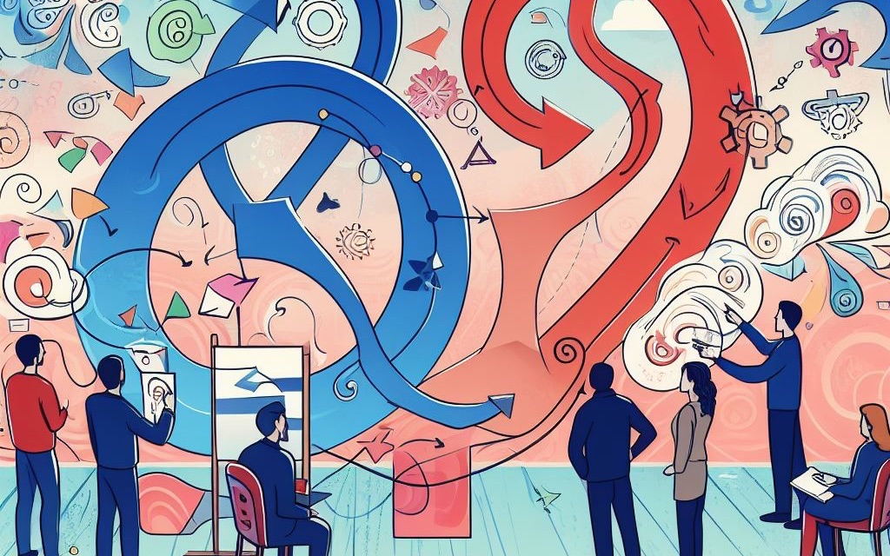
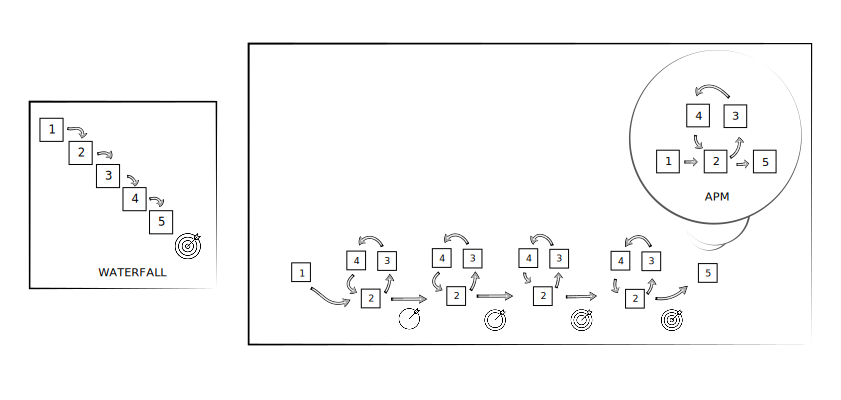

# Project Management

<!-- can I add ideas about FFR, entrainment, synchronization here ?-->

The page 
1. provides a list of methods and tools, that can be used in any field of research. <!-- is this true? "Any"? --> 
2. outlines the principles of Agile Project Management to emphasize the importance of regular feedback. 

{: .no_toc }

## Table of contents
{: .no_toc .text-delta }

1. TOC
{:toc}

---

## Research Narrative, Methods and Tools
The list below presents methods and tools in a chronological order to provide a narrative structure for starting a project. However, it's important to note that researchers are not confined to this particular sequence. They have the flexibility to use these methods and tasks simultaneously, in parallel, or in a random order based on emerging questions and ideas. It is crucial, though, to remain mindful of deadlines when adopting an agile approach.

Remember, the ultimate aim is to utilize these methods and tools in a way that maximizes the understanding and insights gained from the research. So, while a chronological narrative can provide a helpful starting point, it should not be viewed as a rigid framework. Instead, it should serve as a guide to support researchers in their journey towards answering key research questions. 

### 1. Keywords
- First, create a designated file for a list of keywords and organize them alphabetically. This list is often called the index. You can later use these keywords as tags (#tags) in your notes.
- The keyword list evolves, usually growing, but sometimes you will rename, merge or even remove some.
- It's a good idea to borrow keywords from the academic disciplines you are exploring. However, you can also make up new words if you find them useful.
- Be aware that terminologies (i.e., keywords) are not always used consistently across the literature. This is very important to keep in mind when conducting [multi- or interdisciplinary research](https://www.arj.no/2012/03/12/disciplinarities-2/). A good idea is to keep track of these inconsistencies for instance by using '[AKA](https://dictionary.cambridge.org/dictionary/english/aka)' in your notes.

### 2. Search Engines
Use search engines to locate relevant literature (adjust publication date ranges and resource types according to your goals).

1. [University's digital library](https://library.essex.ac.uk/home)
2. [Google Scholar](https://scholar.google.com/)
3. [Academia](https://www.academia.edu/) and [ResearchGate](https://www.researchgate.net/)
4. YouTube, Google, Wikipedia, etc.
5. Audio-only podcasts
6. [Litmaps](https://app.litmaps.co/) can join the dots between scientific papers.
7. [Scispace](https://typeset.io) can summarizes scientific papers.

- Some platforms allow you to bookmark items or create playlists (if you have an account).
- Some platforms only allow reading online or only with specific software after downloading (e.g., Adobe Digital Edition).
- Understand the difference between [peer-reviewed and non-peer-reviewed work](https://duckduckgo.com/?q=peer+reviewed+vs+non+peer+reviewed&t=brave&ia=web).
- Locate discipline-specific journals and explore them further, systematically.
- Google Scholar works great in a browser on phones as well.
- Perhaps use YouTube to search for general ideas and later use search engines focused on academic work.
  - YouTube videos can often provide succinct and entertaining information (aka [edutainment](https://duckduckgo.com/?q=edutainment&t=brave&ia=web) or [infotainment](https://duckduckgo.com/?q=infotainment&t=brave&ia=web)) on a topic.
- Audio-only content allows you to rest your eyes. To take notes, you could pause your podcast player and instead of writing (on an app or in a physical notebook), you could use an audio recorder app to paraphrase what you've heard.

### 3. Skimming, Scanning, and Note-taking
[Skim or scan](https://duckduckgo.com/?q=skimming+vs+scanning&t=brave&ia=web) the literature for ideas, notes, and references.

1. Look for relevance in the following parts of the publication in this order:
   1. Title and keywords (don't continue if these are unrelated to your research).
   2. Abstract (skim).
   3. Introduction (skim).
   4. Conclusion (skim).
   5. Body of the paper (scan).
2. Where to read?
   1. Online (website or PDF via browser).
      - It's okay if you only need to reference the work, but you can't highlight or add notes to the file.
   2. Download (PDF or Adobe Digital Edition file).
      - PDF is better as you can amend the file (e.g. highlight, add comments)
      - Adobe Digital Edition doesn't even allow you to copy to clipboard. There are ways to convert .acsm files if really needed, but it can be tricky or you may need to buy an app. You can find more information on how to remove DRM from PDFs [here](https://www.osxwiki.com/remove-drm-from-pdf).
   3. Print.
      - Printing can help reduce screen time and allow you to read in different environments. Only print for scanning, not for skimming, to reduce waste.
3. Highlight and paraphrase relevant information.
   - Add #tags and continue developing and refining your list of #tags (in PDF or printed).
   - Use color (in PDF or printed).
   - Create fleeting and later permanent notes (add #tags and potential links to other parts of your projects).
4. Take notes (paraphrase as much as possible and reference the source).
5. Draw logical narratives between your ideas using
   - a physical notebook with pens or pencils or (if you think you can use them as figures in your paper)
   - vector-based graphic software (Inkscape, [etc](https://duckduckgo.com/?q=vector+based+graphic+software+compare&t=brave&ia=web).)
   - flowcharts with software ([diagrams.net](https://app.diagrams.net/), [etc](https://duckduckgo.com/?q=flowchart+software+comparision&t=brave&ia=web).)
   - the Zettlekasten method. 

---

#### Four stages of interdisciplinary literature review
When undertaking a research project, employing a four-stage literature review method can significantly enhance your understanding and development of a subject.

1. Initial Stage: You begin by laying a strong foundation, reviewing the existing literature and consulting with experts. This early stage is crucial for you to identify the gaps in knowledge and pinpoint opportunities where your research can contribute meaningfully.

2. Exploratory Stage: At this stage, you expand your horizons, exploring related fields that could inform your research. Here, you start to apply what you've learned to develop early concepts or prototypes, integrating cross-disciplinary insights to refine your approach.

3. Focused Stage: This is where you zoom in on addressing specific challenges that emerged from your exploratory work. You will concentrate on enhancing your conceptual or technological tools, rigorously testing them to ensure they meet the core objectives of your research.

4. Refined Stage: In the final stage, you'll position your research within the wider academic and practical frameworks. This is the time for you to sharpen your research questions and objectives, crystallizing the unique contribution that your work will make to the field.

By following this narrative, you ensure that your research is built on a solid bedrock of knowledge, iteratively refined through exploration and focused development, culminating in a well-defined and impactful contribution to your area of study.

<!-- perhaps add a reference to own PhD chapter on this -->

---

### 4. Reference Management Software
- Choose one to organize a database of your references (papers, book chapters, conference talks, artwork, performances, websites, etc.).
- These software programs can generate reference lists in different referencing styles.
- Consider factors like paid vs free, operating system support, reviews, library support, etc.
- You can often import and export databases between systems, so you don't have to stick to one forever.
- Try to add only the literature that you plan to use and avoid hoarding PDFs and links to papers. Integrate your new knowledge into your knowledge management system. 
- Consider using a different database (library file often with the .bib extension) for different projects to maintain clarity.
- E.g., JabRef, Zotero, EndNote and Mendeley.

### 5. Discussions/Feedback
Seek feedback (e.g., from peers, supervisors, [your minimum viable audience](https://seths.blog/2019/03/the-minimum-viable-audience-2/), and the authors of papers you plan to reference) via:
  - emails
  - forum/group discussions
  - interviews (audio, video, text)
  - surveys (e.g., via Google Forms, SurveyMonkey, [etc](https://crm.org/news/best-online-survey-tools))
  - files via shared workspaces (e.g. Google, Microsoft, Dropbox, GitHub)

### 6. Production
Consider:
  - The media that is best to convey your message (e.g., text, audio, video-based, or mixed) and explore relevant software and hardware needs.
  - Making or taking assets to add to your work (e.g., graphics, photos, audio, or video).
  - Using language tools to support your writing (e.g., LanguageTool, Grammarly, Hemingway App, ProWritingAid or ChatGPT).
  - Compare price and features and see how it can be added to your workflow.

### 7. Publishing and Dissemination
- Based on your outcomes and the explored disciplines, consider relevant:
  - Academic journals, conferences, symposiums.
  - Non-academic journals and websites (printed or online) and public events.
- Join or create groups to help you find your audience (e.g. via [JiscMail](https://www.jiscmail.ac.uk))
- Create mailing lists (e.g., via MailChimp).
- Contextualize for different audiences. (Explore [Justin's ideas ](https://www.justinwelsh.me/) freely available on his blog and interviews on YouTube.)
- [Compress PDFs](https://duckduckgo.com/?q=compress+PDF&ia=web) if needed.

<!--
- no need to know everything before you start/ship
- learn to fail, don't make it too personal i.e. distance your emotions from it perhaps by not being too attached to expected outcomes
- if you don't know what you want, start with what you don't want e.g. by making a list
- write content that is easy to change e.g. use raw text
- organise data chronologically, with EU data format and by using taxonomy e.g. categories i.e. groups/themes/types and tags - you could consider them as keywords as well 

## blogging and social media
- publish ones, share link, image and abstract (or subtitle) everywhere else
- traffic to point back to your website 

## 5-10 years plan (for fun)
- check a software that can make you older, and than use this to prepare you personal development plan

## working with music
- don't listen to music with lyrics
- fit the tempo to your work
- if you are writing, try something minimal (fast or slow, but without many changes - make it gradually change not instantly)
- you could watch tutorial videos and listen to the narration and listen to your music in the background with lower volume (e.g. two youtube videos open, one music, one lecture)
-->

<!-- 
### 8. invoicing 
- add freelancing, clients, invoicing, tax-return

-->

##  Agile Project Management
<!-- find literature in education on this (feedback, feedforward) -->

One distinguishing feature of Agile Project Management (APM) is its emphasis on regular feedback, in contrast to traditional methods such as the waterfall model.

> While traditional waterfall project management focuses on achieving a single big outcome at the end of the project, APM produces cumulative outcomes by iterating through development stages.

*Can you think of examples where you have used (or are still using) these two methods in your education?*

### 1. Goals
Conduct an initial literature review and discussions to help establish:
  1. one or more **research questions** (RQs) and
  2. steps towards answering the RQs with **research objectives** (ROs)
      - ROs are basically the main tasks of your project to help you answer the RQs.
      - It's fine if the RQs and the ROs change over time (but don't overdo it).

### 2. Design
Draft 
- creative concepts (narratives, ideas) to address the project goals.
- a timeline with deadlines and milestones using a [Gantt chart](https://www.gantt.com/).
- a thorough task list (this will need regular updating).

### 3. Development
Developing drafts can involve:
1. Gathering more data (e.g., via exploratory, then focused and finally refined literature reviews).
2. Analyzing your data. 
3. Producing 
   1. text (e.g., for books, journal articles, blog posts).
   2. audio (e.g., interviews, sound design and music, etc.).
   3. video (e.g., a vlog with screencasts, short film documentaries, art films, music videos).

### 4. Testing
Test the developed work, even if it is in progress (i.e unfinished) (e.g., via informal or formal feedback).

### 5. Deployment
In this stage our work is 
1. published 
2. disseminated (i.e., shared, advertised) via 
   - academic or public events
   - academic or public channels (e.g., journals, magazines, or music labels, film festivals).
     - can self-publish as well (e.g. on your own website for your own 'tribe')
   - through your own online profiles (e.g. LinkedIn, ResearchGate, Twitter, in the footer of your email, to your own mailinglist, other mailinglists)

It's important to contextualize our work for different channels (synchronize your work with your target audience's thinking, e.g., by using context-specific vocabulary).

## Further Ideas

### Timekeeping
- Set some time aside and only concentrate on your work (e.g., switch off notifications on your devices, don't check Facebook messages or emails, don't listen to distracting music, etc.).
- Track your time (e.g., work for 1 hour and make sure you understand that your brain needs to warm up to create some kind of momentum).
- Leave time for putting things in your log and your task lists.
- Make a Gantt chart for your milestones and deadlines.

### Project Management Combo
To evolve your project management method in your GitHub repository, you could experiment with installing [VSCodium](https://vscodium.com/) on your personal computer.

[GitHub Desktop](https://desktop.github.com/) can sync your online and local (computer HDD) repositories.

If you used GitHub Pages to create a website, you could also consider installing [Jekyll](https://jekyllrb.com/) on your computer to preview your website before publishing changes online.

If you wish to use the digital [Zettlekasten](https://youtu.be/rOSZOCoqOo8) method locally or in a GitHub repository, check out [Foam](https://foambubble.github.io/foam/).

You could further develop this combo with [JabRef](https://www.jabref.org/) (for reference management), LaTeX (for beautiful PDFs via [Pandoc](https://pandoc.org/)), and [LanguageTool](https://dev.languagetool.org/http-server.html) (for grammar and spell checking).

#### Alternatives
- [Trello](https://trello.com/)
- [Workflowly](https://workflowy.com/)
- [Roam Research](https://roamresearch.com/), a Zettlekasten software.
- [Obsidian](https://obsidian.md/) another Zettlekasten software.
- [Evernote](https://evernote.com/)
- [Notion](https://www.notion.so/)

<!--
### Emails
- There are different email clients and different email formats (e.g., HTML vs text).
- Attach file or link file (same for forums) to email (e.g., link with WeTransfer/Dropbox/Google Drive or images with [imgur.com](https://imgur.com/)) to reduce the size of your email.
- Learn about spam filters, how to [not get caught](https://www.mail-tester.com/) in them, and common practices (e.g., ask people to whitelist your email address, etc.).
- https://www.refinery29.com/en-gb/how-to-send-follow-up-emails?utm_source=pocket-newtab-en-gb
-->

### Miscellaneous
Bavelier, D (2012) **Your brain on video games**. TED talk. A neuroscientist talks about the benefits of video gaming on your eyesight and multitasking. She distinguishes between multitasking and multimedia-tasking. Video available on [YouTube](https://youtu.be/FktsFcooIG8). Find her papers on [Scholar](https://scholar.google.com/citations?hl=en&user=KLnfuU8AAAAJ). 

Waitzman (2022) **Best Blinkist alternatives in 2022**. Although the Blinkist app is easy to use and provides you with access to plenty of features,there are alternatives for seeking book-summaries. Article available on [Speechify](https://speechify.com/blog/alternatives-to-blinkist/). 

Andy Stapleton with insider secrets of academia. Available on [YouTube](https://www.youtube.com/@DrAndyStapleton/about).

Life Hacker (2023) **Productivity Method List**. Available on [lifehacker.com](https://lifehacker.com/best-productivity-methods-1850862925)

Dan Koe (2023) **4 Hours Of Focused Work A Day Will Change Your Life** Available on [YouTube](https://www.youtube.com/watch?v=CvsnW06-yNY). 

## Image credits
Header image was generated with Image Creator (DALL·E 3) on 27 October 2023 at 10:02 pm using "Agile project management methodology with feedback loops. People drawing narratives and have the feedback loop behind them, not above them. They is also a lot of discussion between them. Kandinsky style."