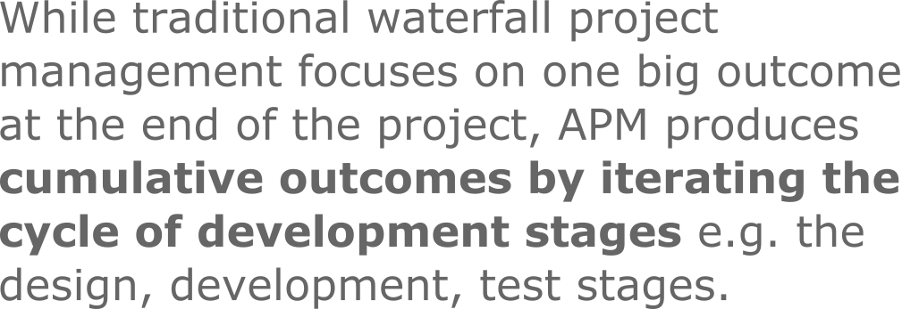

# Project management

{: .no_toc }

## Table of contents
{: .no_toc .text-delta }

1. TOC
{:toc}

---

<!--
- compare 
  - CS220 states
    - for me 
    - for students
  - emphasise the importance of circles (asking for feedback)
  - find literature in education on this (feedback, feedforward) 
- add freelancing, clients, invoicing, tax-return
- add: https://app.litmaps.co/
- check : https://www.youtube.com/@DrAndyStapleton/videos
-->

  

<!-- add ideas about FFR, entrainment, syncronisation -->

  

## Five APM stages for or academic research

### 1. goals
- conduct an initial literature review and discussions to help establish 
  - one or more **research questions** (RQs) and
  - steps toward answering the RQ with **research objectives** (ROs) 

### 2. design
- draft creative concepts (narratives/ideas) to address the project goals

<!--
- define thorough TODO list (keep it agile)
- define a timeline with deadlines/milestones using a [Guntt chart](https://www.gantt.com/)
-->

### 3. development
- develop your concepts

<!-- 
- more literature review e.g. gathering data to compare/analyse/critic/repurpose/re-contextualise, etc. 
- writing text e.g. books, journal articles, blog posts
- producing audio e.g. a podcast series, sound design and music, interviews, etc. 
- producing video e.g. a vlog with screencasts, short film documentaries, art films, music videos 
-->

### 4. test
- test/analyse the developed concepts

### 5. deployment
- share your findings

<!-- 
- demonstrated and presented progress at public or academic events
- self-published your work online
- publish through a label, journey, etc. 
- here we publish i.e. distribute, disseminate, share and advertise our work 
- important to contextualise for different channels (synchronise your work with your target audience's thinking e.g. by using context specific vocabulary)
- your portfolio website can have the full project or a brief outline with an external hyperlink e.g. as seen on https://khofstadter.com/
-->

  

## Useful methods/tool
The list is organised with a chronological narrative (e.g. to be used to kickstart a project) however, as APM stages iterate cycles, the use of methods/tools below can be executed sequentially, parallel or driven by emerging questions and ideas. 

### 1. to establish keywords
   
- create a separate file for a list of keywords (#tags) ad organise them alphabetically
- this list evolves (e.g. you might find better keywords later)
- a good idea is to borrow keywords from the academic disciplines you research, but you can make up some too
- terminologies (e.g. keywords) are not always used consistently across the literature 
 - this is more important to keep in my when conducting [multi- or interdisciplinary research](https://www.arj.no/2012/03/12/disciplinarities-2/)
 - keep track of inconsistencies (e.g. by using '[aka](https://dictionary.cambridge.org/dictionary/english/aka)' and then referencing the sources)

### 2. search engines
Use search engines to locate relevant literature (adjust publication date ranges and resource types according to study).

1. [university's digital library](https://library.essex.ac.uk/home)
2. [Google Scholar](https://scholar.google.com/)
3. [Academia](https://www.academia.edu/) and [ResearchGate](https://www.researchgate.net/)
4. YouTube, Google, Wikipedia, etc. 
5. audio only podcasts
- some platforms allow you to bookmark items or create playlists
- some allow you only to read online or with specific software after downloading (e.g. Adobe Digital Edition)
- understand the difference between [peer-reviewed and non peer-reviewed work](https://duckduckgo.com/?q=peer+reviewed+vs+non+peer+reviewed&t=brave&ia=web)
- locate discipline specific journals
- Google Scholar works great in a browser on phones as well
- perhaps use YouTube to search for general ideas and later search engines focused on academic work
  - YouTube videos can often give you succinct and entertaining information (aka [edutainment](https://duckduckgo.com/?q=edutainment&t=brave&ia=web) or [infotainment](https://duckduckgo.com/?q=infotainment&t=brave&ia=web)) on a topic 
- audio only allows you to rest your eyes. To take notes, you could pause your podcast player and instead of writing (on an app or in a physical notebook) you could use an audio recorder app to paraphrase what you've heard. 

### 3. reference management software
e.g. JabRef, Zotero, EndNote, Mendeley

- choose one to organise a database of your references (papers, book chapter, conference talks, artwork, performances, website, etc.)
- they can generate your reference lists in different referencing styles
- consider paid vs free, OS support, reviews, library support, etc.
- you can often import/export databases between systems (so don't worry, you don't have to stick to one forever)
- try to add only literature that you plan to use (don't horde)
- try to use a different database (library file often with the .bib extension) for different projects for clarity

### 4. skimming, scanning and note taking
[Skim or scan](https://duckduckgo.com/?q=skimming+vs+scanning&t=brave&ia=web) literature for ideas/notes/references. 

1. look for relevance in the following parts of the publication in this order 
   1. title and keywords (don't carry on if these are unrelated to your research)
   2. abstract (skim)
   3. introduction (skim)
   4. conclusion (skim)
   5. body of paper (scan)
2. where to read?
   1. online (website or PDF via browser)
      - OK if you only need to reference the work (but you can't highlight or add notes to the file)
   2. download (PDF or Adobe Digital Edition file)
      - PDF is better as you can amend the file 
      - Adobe Digital Edition doesn't even allow you to copy to clipboard (there are ways to convert .acsm files if really needed, but [can be tricky or you need to buy an app](https://www.osxwiki.com/remove-drm-from-pdf))
   3. print
       - help reduce screen time, read in the early morning, later at night, in the bath, etc. 
       - only print for scanning (not for skimming) to reduce waste
3. highlight/paraphrase relevant information 
   - add #tags and continue developing and refining your list of #tags (in PDF or printed)
   - use colour (in PDF or printed)
   - create fleeting and later permanent notes (add #tags and potential links to other parts of your projects)
4. take notes (paraphrase as much as possible and reference source)
   - experiment with the basic of the [Zettlekasten](https://www.youtube.com/results?search_query=zettelkasten) method (inbox --> permanent --> project)
   - consider drawing logical narratives between your ideas using 
     - a physical notebook with pens/pencils
     - vector based graphic software (Inkscape, [etc](https://duckduckgo.com/?q=vector+based+graphic+software+compare&t=brave&ia=web).)
     - flowcharts with software ([diagrams.net](https://app.diagrams.net/), [etc](https://duckduckgo.com/?q=flowchart+software+comparision&t=brave&ia=web).)

### 5. discussions/feedback
- seek feedback (e.g. from peers, supervisors, [your minimum viable audience](https://seths.blog/2019/03/the-minimum-viable-audience-2/), the authors of papers you plan to reference) via 
  - emails
  - forum/group discussions
  - interviews (audio, video, text)
  - surveys (e.g. via Google Forms, SurveyMonkey, [etc](https://crm.org/news/best-online-survey-tools).)

### 6. production
- consider 
  - which media is best to convey your message (e.g. text, audio or video based or mixed) and explore relevant software and hardware needs)
  - [making or taking assets](content-production.md) to add to your work (e.g. graphics, photos, audio or video)
  - using language tools to support your writing (e.g. LanguateTool, Grammarly, Hemingway app, ProWritingAid)
  - compare price and features and how it can be added to your workflow

### 7. publishing and dissemination 
- based on your outcomes and the explored disciplines, consider relevant
  - academic journals, conferences, symposiums
  - non-academic journals/website (printed or online) and public events
- join or create groups to help you find your audience
- create mailing lists (e.g. via MailChimp)
- contextualise for different audiences
- [compress PDFs](https://duckduckgo.com/?q=compress+PDF&ia=web) if needed

<!--
- no need to know everything before you start/ship
- learn to fail, don't make it too personal i.e. distance your emotions from it perhaps by not being too attached to expected outcomes
- if you don't know what you want, start with what you don't want e.g. by making a list
- write content that is easy to change e.g. use raw text
- organise data chronologically, with EU data format and by using taxonomy e.g. categories i.e. groups/themes/types and tags - you could consider them as keywords as well 

## blogging and social media
- make once, share link, image and abstract (or subtitle) everywhere else
- traffic to point back to your website 

## 5-10 years plan
- check a software that can make you older,and than use this to prepare you personal development plan

## working with music
- don't listen to music with lyrics
- fit the tempo to your work
- if you are writing, try something minimal (fast or slow, but without many changes - make it gradually change not instantly)
- you could watch tutorial videos and listen to the narration and listen to your music in the background with lower volume (e.g. two youtube videos open, one music, one lecture)
-->

  

## Project management combo
My preferred combo: 

### GitHub, Markdown with Visual Studio Code +
To evolve the [GitHub-Markdown](your-website.md) tool you set up last week for project management, you could experiment with installing [Visual Studio Code (VSC)](https://code.visualstudio.com/) on your personal computer or using its [online version](https://vscode.dev/). 

[GitHub Desktop](https://desktop.github.com/) can sync your online and local (computer HDD) repositories.

If you used GitHub Pages to create a website, you could also consider installing [Jekyll](https://jekyllrb.com/) on your computer to preview your website before publishing changes online. 

If you wish to evolve your basic [Zettlekasten](https://youtu.be/rOSZOCoqOo8) method in your private repository (inbox --> permanent (with tags/links) --> project), you can use the VSC extension called [Foam](https://foambubble.github.io/foam/). 

You could further develop this combo with [JabRef](https://www.jabref.org/) (for reference management), LaTex (for beautiful PDFs via [Pandoc](https://pandoc.org/)) and [LanguageTool](https://dev.languagetool.org/http-server.html) (for grammar and spell checking). 

<!-- 
### Visual Studio Code
You can find a short screencast where I introduce this software [here](https://youtu.be/taFSpPeHs0o). If you need any help with setup, please let me know. 
-->

  
### alternatives
- [Trello](https://trello.com/)
- [Workflowly](https://workflowy.com/)
- [Roam Research](https://roamresearch.com/) - Zettlekasten method
- [Obsidian](https://obsidian.md/) - Zettlekasten method
- [Evernote](https://evernote.com/)
- [Notion](https://www.notion.so/)

<!--
### Foam issue on GitHub
- Foam's known issue: it does not work well when using the GitHub Repositories extension, because the one the essential extensions used for Foam, Markdown All in One does not work with virtual workspaces. So, the current idea is to use Foam with GitHub Desktop. To monitor issue: https://github.com/yzhang-gh/vscode-markdown/issues/996
-->

  

## Further ideas

### timekeeping
- set some time aside and only concentrate on your work (e.g. switch of notifications on your devices, don't check Facebook Messages or emails, don't listen to distracting music, etc.)
- track your time (e.g. work for 1 hour and make sure you understand that your brain needs to warm up (to create some kind of momentum)
- leave time for putting things in your log and your TODO lists
- experiment with a Gantt chart for your milestones and deadlines

### emails
- there are different email clients
- and different email formats (e.g. HTML vs text)
- attach file or link file (same for forums) to email (e.g. link with WeTransfer/Dropbox/Google Drive or images with [imgur.com](https://imgur.com/)) to reduce the size of your email
- learn about spam filters, how to [not get caught](https://www.mail-tester.com/) in them and common practice (e.g. ask people to whitelist your email address, etc.)

### more
- Bavelier, D (2012) **Your brain on video games**. TED talk. A neuroscientist talks about the benefits of video gaming on your eyesight and #multitasking. She also distinguishes between multitasking and multimedia-tasking. Video available on [YouTube](https://youtu.be/FktsFcooIG8). Find her papers on [Scholar](https://scholar.google.com/citations?hl=en&user=KLnfuU8AAAAJ). 

 - Waitzman (2022) **Best Blinkist alternatives in 2022**. Although the Blinkist app is easy to use and provides you with access to plenty of features, there are also a few downsides to Blinkist. Here's what you should consider when seeking #book-summaries. Article available on [Speechify](https://speechify.com/blog/alternatives-to-blinkist/). 

