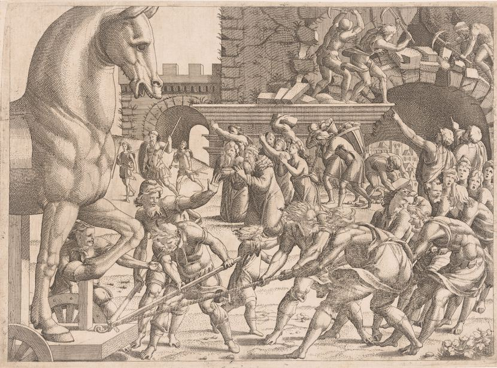
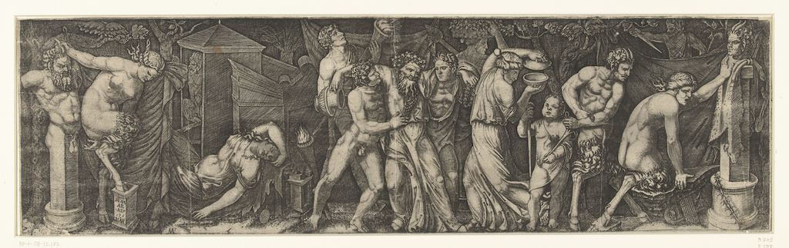
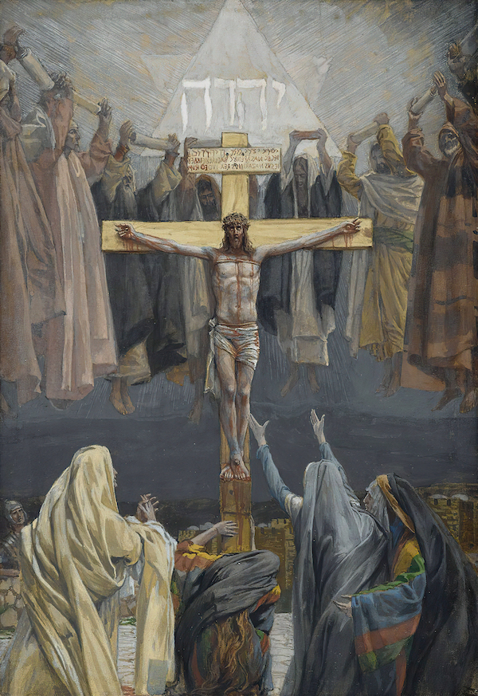
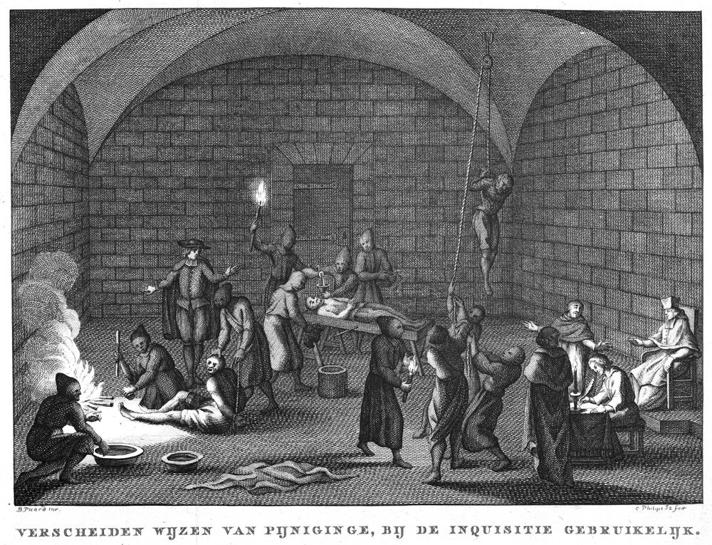
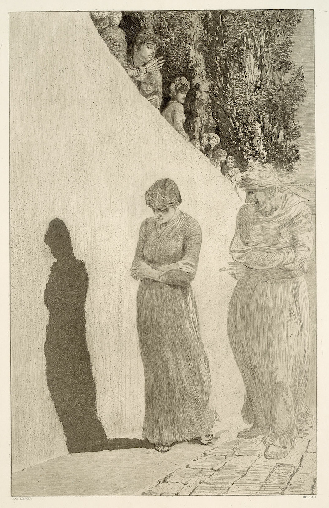

# Unpacking Schmachtenberger's War on Sensemaking Series

Last update: Mar 2024

{{page.description}}

## Table of contents
{: .no_toc .text-delta }

1. TOC
{:toc}

---

## 1. Introduction 
In the [War on Sensemaking](https://civilizationemerging.com/media/rebel-wisdom-war-on-sensemaking) video series, Daniel Schmachtenberger explores the broken information ecology and how we can improve our sensemaking.

This write-up (draft) introduces my main takeaways from the first episode in the series. I tried to thematically organize my initial notes to create a clearer narrative that introduces, analyzes, and proposes solutions to the problems associated with information warfare. [^amended]

[^amended]: I extended my initial notes with additional research and personal examples. I plan to review the other episodes in the series and extend this write-up.

> Sense-making is the process by which we make sense of the world, especially complex situations for which there are usually no simple, apparent explanations. ~ [David Gurteen](https://conversational-leadership.net/sensemaking/)

> Sensemaking is about creating space for listening, reflection and the exploration of meaning beyond the usual boundaries, allowing different framings, stories and viewpoints to be shared and collectively explored. ~ [Centre For Public Impact](https://www.centreforpublicimpact.org/insights/what-is-sensemaking)

The reason to become better sensemakers is to help understand (1) how and (2) why the truth is often distorted, either unintentionally or on purpose.

Knowing the truth (as much as possible) will help us make more meaningful decisions for ourselves, our families and friends, sociocultural and economic communities, our countries, the ecosystem, etc.

### Themes

#### (1) Problem: Broken Information Ecology and Information Warfare
The concepts of a broken information ecology and information warfare are introduced as problems, highlighting our challenges of recognizing truth in a landscape where information may be distorted or manipulated for various reasons. Daniel encourages us to be skeptical towards
   1. **news**, suggesting that they engage in narrative warfare rather than providing objective information. The narratives can be linked to politics, religion and market dynamics where information is strategically controlled to influence our opinions and behaviors. This can include broadcast and social media channels or even listening to an in-person presentation.
   2. **academia**, suggesting that there can be conflict of interest e.g. via cherry-picking data.

#### (2) Analysis: Information can be Representative, Truthful and Manipulative
The distinction between being representative (accurately reflecting reality), truthful (aligning with one's beliefs causing unintentional distortion) and manipulative (distorting truth on purpose) is discussed, emphasizing the complexity of evaluating information.

#### (3) Solution: Practice Epistemology
To overcome the challenges of sensemaking in complex information environments, we need to practice better sensemaking for which Daniel makes a few suggestions e.g. to be comfortable with not understanding things.

## 2. Problem: Broken Information Ecology and Information Warfare
### 2.1 Can we trust politics, religions and the market?
Our daily news are mainly propaganda, part of narrative warfare. 

Who narrates the information? Politics, religions, businesses? All of them? 

Are they connected? Think about 
- [political lobbying by businesses](https://www.theguardian.com/politics/2014/mar/12/lobbying-10-ways-corprations-influence-government)
- religious influence in politics (e.g. linked to [abortion](https://www.npr.org/2022/05/14/1098800437/religion-role-politics))
- [corporate control of media outlets](https://youtu.be/b9yAUiJZjLQ?si=GFBJ_TuwYZzaVI3O)

<!-- Do we need a religious example e.g. how Jesus' teachings got bent? -->

<!-- Find examples where this is not the case where businesses generate fake reviews or where a company pays Amazon or Google to rank higher in a search list? -->

[Comparing news](https://www.ecosia.org/search?tt=e8eb07a6&q=compare%20news&addon=brave) can help us see the same information from different political perspectives. [^politics]  

We should strive to access information that is high in signal (truth) and low in noise (distortion).

### 2.2 Can we trust academia?
One might assume that academia is reliable, but is it? 

There have been instances of academic distortion e.g. via cherry-picking data. 

Why?
1. corporate funding of research e.g. 
   - [tobacco industry funding research](https://scholar.google.co.uk/scholar?hl=en&as_sdt=0%2C5&q=Tobacco+Industry+Funding+of+Scientific+Research&btnG=)
   - [climate change denial and industry influence](https://books.google.co.uk/books?hl=en&lr=&id=RsYr_iQUs6QC&oi=fnd&pg=PA144&dq=climate+change+denial+in+academia+and+industry+influence&ots=r8LB04lf0H&sig=g8QK2PqH5NVB7BfIDr0Eu92d4Zk#v=onepage&q&f=false)
   - [pharmaceutical industry influence on drug trials](https://link.springer.com/article/10.1007/s11948-011-9265-3)
2. just want to get papers published fast to be able to apply for funding 

More on this from Andy Stapleton: 
- [The Academic Fraud Epidemic - The Alarming Reality](https://www.youtube.com/watch?v=P0tT2i3TZx8)
- [Bribes and Betrayals: Academia's Elite Corrupted! [Scientific Fraud!]](https://www.youtube.com/watch?v=VSoryzlZJHk)
- [The Alarming Trend in Ivy League Admissions...](https://www.youtube.com/watch?v=FsskFJNN5j8)

## 3. Analysis: Representative, Truthful and Manipulative
### 3.1 How is truth (base reality and objective truth) communicated?
Where is the noise (distortion) added to the signal (truth)? 

When truth (base reality) is communicated, it can be 

1. representative (the most accurate representation of the truth)
2. truthful (the sender believes it is true, but it is distorted)
3. manipulative <!-- Is this a good term to describe this? -->

 

 

Keep in mind that (1) withholding information and (2) the receiver's perception of the signal (through their biases) can also lead to distortion. <!-- Find example using an analogue/digital communication protocols which then can be linked back to week 1's lecture? -->

We don't engage with base reality (signal/truth) because we

1. can't be everywhere where something important is happening (e.g. in Israel and Gaza)
2. don't have time to consume and then analyze the original data (e.g. a two-hour-long interview with the president)

So, we proxy our sensemaking i.e. we form our understanding using the summaries and opinions of people we trust. 

> Everything [news, research outcomes] should be as simple as it can be, but not simpler. ~ [Einstein](https://quoteinvestigator.com/2011/05/13/einstein-simple/)

Do we follow this advice? Do the people we trust follow this advice?

Oversimplified news (e.g. sound bytes, tweets) are quite often not 'simple' but 'simpler' i.e. distorted versions of the truth. <!-- Could I have made several parts of this module simple instead of simple? Why didn't I? Same with your essay. -->

Also, consider how your sensemaking is 'guided' by e.g. typography, tone, choice of words and additional music (compare Lee vs Norris [here](https://www.youtube.com/watch?v=FUfuZJI9LK4) and [there](https://youtu.be/16Jy-K0kjbE?si=zhJlV8rMnGHuZ-U7))<!-- Find examples on YouTube with real news where music is sensational.-->.

Attention and clear (objective) thinking require training. Like a muscle, it needs to be stressed e.g. by doing your own research. <!-- Picture of body building and new neural pathways developing. -->

 

So, the good news is that sensemaking can be developed. 

The bad news is, that people in general, don't care about developing it because 
   1. they already decided what to believe in or 
   2. they gave up trying to understand deeper structures of reality 

Most people can't handle the cognitive complexity of base reality and still make a living i.e. we don't have time and energy to do good sensemaking as well as feed the kids. 

Unfortunately, Daniel says, "giving up on sensemaking is kind of an expression of a type of nihilism [which] feeds into further nihilism". <!-- #personal Why did I give up checking the news? I needed time to concentrate what was in front of me; PhD, work, family, health. -->

 

### 3.2 Why is the truth distorted?
Distorting information is not human; animals and plants do it too. <!-- What are the best examples here? -->

We humans started distorting more with abstract signals e.g. via writing. <!-- Does he mean when we started using symbols e.g. cave drawings? -->

<!-- Can I add an example from 1984 when it comes to using media for distortion? Also, something from the nazi Germany? What other historic examples could I add? -->

Exponential technology can misinform exponentially i.e. the faster the technology grows (like social media or AI-driven applications), the faster misinformation can spread if not properly managed.

A detailed study on the evolution of deception can be found [here](https://royalsocietypublishing.org/doi/10.1098/rsos.201032). 

We distort base reality i.e. lie for different reasons e.g. there is a difference between a company hiding its pollution, someone writing good comments on his friend's bad essay, tricking others in poker or football games or lying to children about Santa. <!-- We could also lie to people because we think they wouldn't understand the truth. What other examples can we make here? -->

Compare how [deepfakes are used in politics](https://youtu.be/wxEpPin8MWw?si=a-ZIem7gMMFxjo8D).

Political parties, religions and businesses are interested in 'helping' us understand base reality. There are often many of them so they are fighting for our attention. This leads to information warfare. (In a totalitarian country the situation is different.)

Governments, businesses, people use game theory (mathematical models of strategic interactions) to compete with each other. 

<!-- Add a screenshot a strategy game? -->

He talks about genetics and memetics in relation to how people adapt and mutate information. 

Example (religion): Jesus' key message was forgiveness, even though he was being crucified. 

> Father, forgive them, for they do not know what they are doing. 
 
 

 

But Christianity, in Jesus' name, went on crusades and tortured people through the inquisition. 

 

 

<!--
Centralized religions with one god, as opposed to decentralized ones with many gods (spirits) support our governments and social systems.  What was Jesus actually saying about the one good? Was that one good democratic e.g. linked somehow to the more balanced spirit world? Because as many other religions, this as well, Daniel says, was used to maintain the hierarchical structure of society. -->

Daniel says that true understanding (of base reality) [is complex](https://ttc.tasuki.org/display:Code:gff,sm,jhmd,jc,rh) and therefore difficult to advertise. People don't want to (or can't) spend enough time on 'real thinking', so 'simpler' versions of the truth can spread easier. 'Simulated thinking' <!-- Where does this term come from? --> requires less processing, is often reassuring (as its source is the in-group, the echo chamber) and is often presented in an stimulating form.

### 3.3 In-groups and out-groups
Daniel also talks about in-groups and out-groups and how they use propagator and protector memes in memetic ecosystems. <!-- This is important so let's define them. --> 

An example of a religious protector meme: "Faith is good, doubt, [critical thinking] is bad"

The problem is the partiality of our perspective; we often belong to an in-group and are informed in that group's echo chambers. 

Why? Leaving the group is uncomfortable, maybe even scary. 

 

 

## 4. Solution: Practice Epistemology
<!-- Define epistemology and how it links to critical thinking and ontology. -->

Reality is complex, so what can help our sensemaking? 

We should practice epistemology (the theory of knowledge) with a group of people we also want to practice this and whom we can trust.   

In order to heal our information ecology we need to

1. seek to understand before wanting to be understood
2. feel the importance of understanding base reality (despite the pull of nihilism)
3. understand that it is very complex (that there can be multiple perspectives) and that there is always more to learn (we should be humble, practice humility but also be brave when facing the unknown)

When perceiving information, we should try to understand

1. why the sender is sending (e.g. to understand the reasons for a potential distortion)
2. how much distortion is happening (e.g. by looking at the sources, references)
3. all perspectives and find their common grounds (thesis + antithesis = synthesis). <!-- Link this to analysis/synthesis in research methodology? Also how can then synthesis be linked to 'creativity' to creating something novel? And then that if something is new for us (e.g. a new understanding) that is still very important even if it is not new for other people (e.g. they understood it last year or when they first had a child). --> This is where we can gain higher order clarity. <!-- Link to Flatland. -->
4. our own biases 
5. what holds us back when engaging with our out-groups,  with the perspectives we find distorted (untrue)
6. where we can practice this kind of sensemaking in groups (where we can be honest about how much we don't know and about our doubts).

> For I was conscious that I knew practically nothing... ~ [Plato](https://en.wikipedia.org/wiki/I_know_that_I_know_nothing)

## Resources
- https://civilizationemerging.com/media/rebel-wisdom-war-on-sensemaking/
- https://www.facebook.com/danielschmachtenberger
- https://medium.com/rebel-wisdom/the-war-on-sensemaking-53710561afce

## Tasks
1. extend notes with sensemaking 2–4 ... video analysis
2. extend notes with a classification of forms of political government, the history of their evolution and how their perspectives can be linked to sensemaking

## Log
- 2023-03-21 Revised the narrative and added figures, primarily using [Museo](https://museo.app/). Grammar checked with [Quillbot](https://quillbot.com/grammar-check).
- 2023-03-19/20 Refined the narrative of the write-up and looked at adjusting it for an oral presentation. 
- 2023-03-17/18 Revised notes in a computer file and looked for ways to thematically organize them. Also, asked an online AI to summarize transcript. I asked GPT3.5 to thematically analyze the AI summary. Then I compared my themes with the AI themes and adjusted my themes and narrative slightly. 
- 2023-03-11 Took notes in physical notebook while listening to the talk. I made sure to highlight parts that were unclear and parts where I can contribute with my personal experiences. 

## Image Credits
- Daniel Schmachtenberger talking from the source video, produced by Rebel Wisdom (interviewer is David Fuller)
- Old Woman Reading, Probably the Prophetess Anna (1631) Rembrandt van Rijn
- Bringing in the Trojan Horse (1545) by Jean Mignon
- Bacchanal with a Drunken Bacchus, and Satyrs and Maenads (1527) Marcantonio Raimondi, after anonymous
- Simon the Cyrenian Compelled to Carry the Cross with Jesus (1886-1894) by James Tissot
- Various methods of torture used by the Inquisition (1775) by Jan Caspar Philips
- Shame, plate nine etching (1887) by Max Klinger

## Footnotes

[^politics]: The two main perspectives could be linked to the [core beliefs of the political left and right](https://youtu.be/7LqaotiGWjQ?si=hqp68tp6Cav-V-J9&t=5159). Or is it [more complicated](https://youtu.be/jJEuZrvNYg0?si=XU7iCrbnMc3MAiHG)? <!-- Are these perspectives linked to the jin/jang? --> The [Good In Theory Podcast](https://goodintheorypod.com/) is an informative and entertaining show on the evolution of politics.
