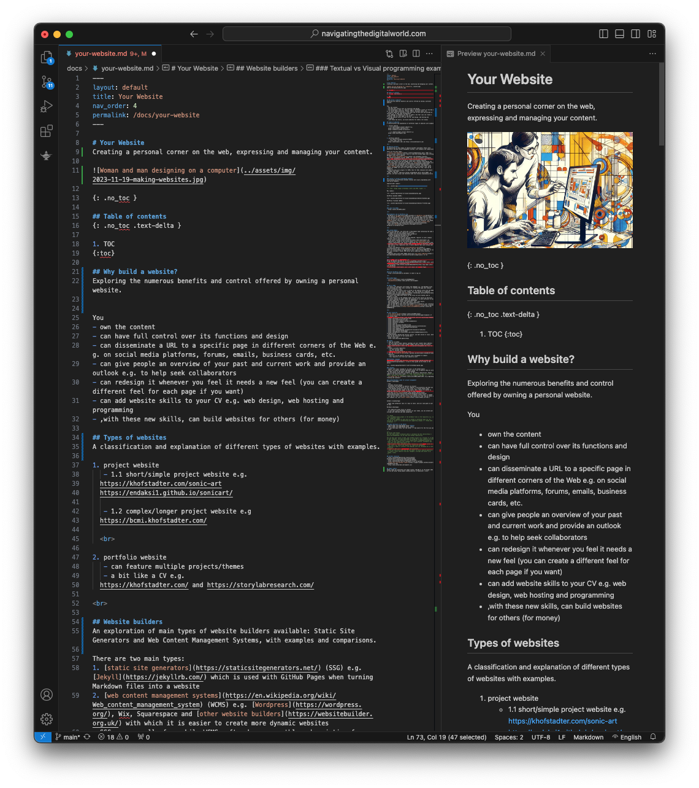
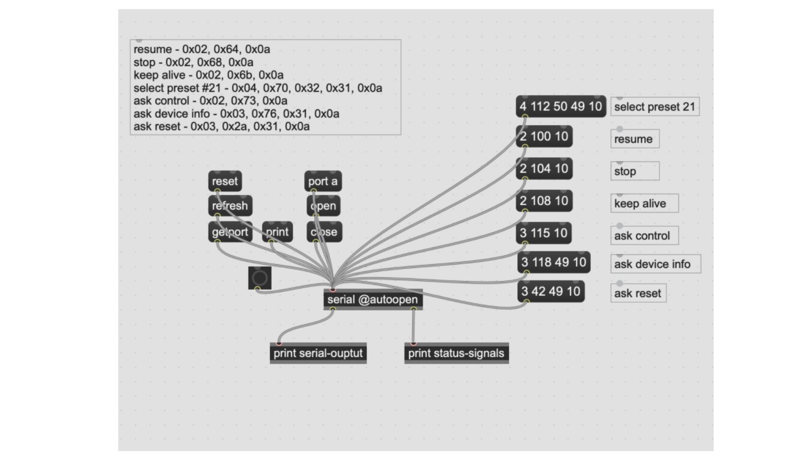
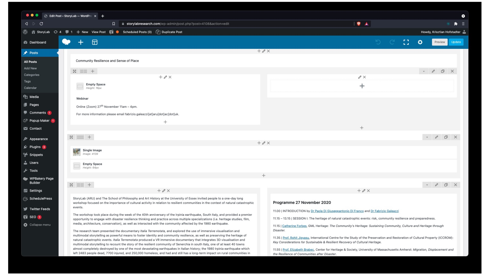
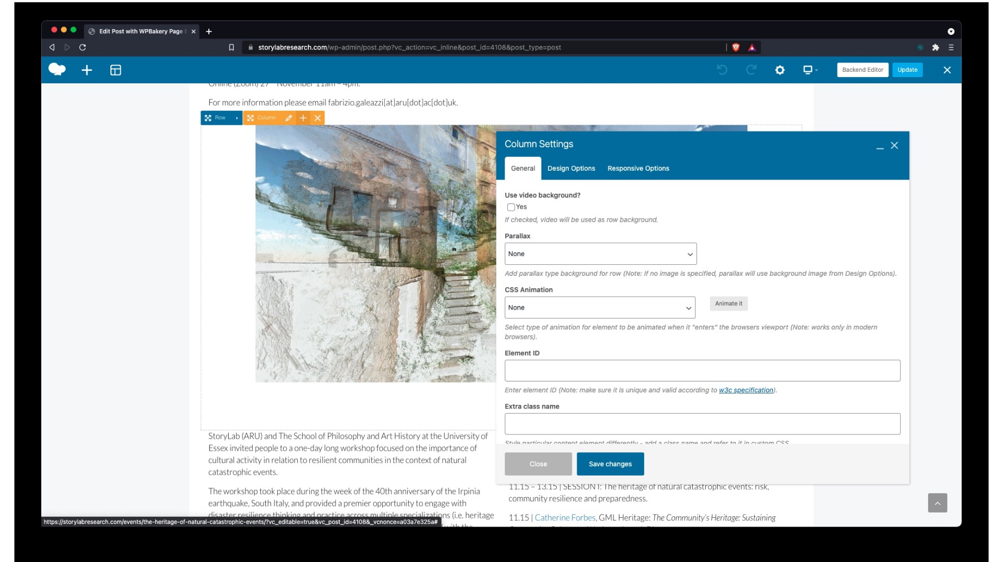
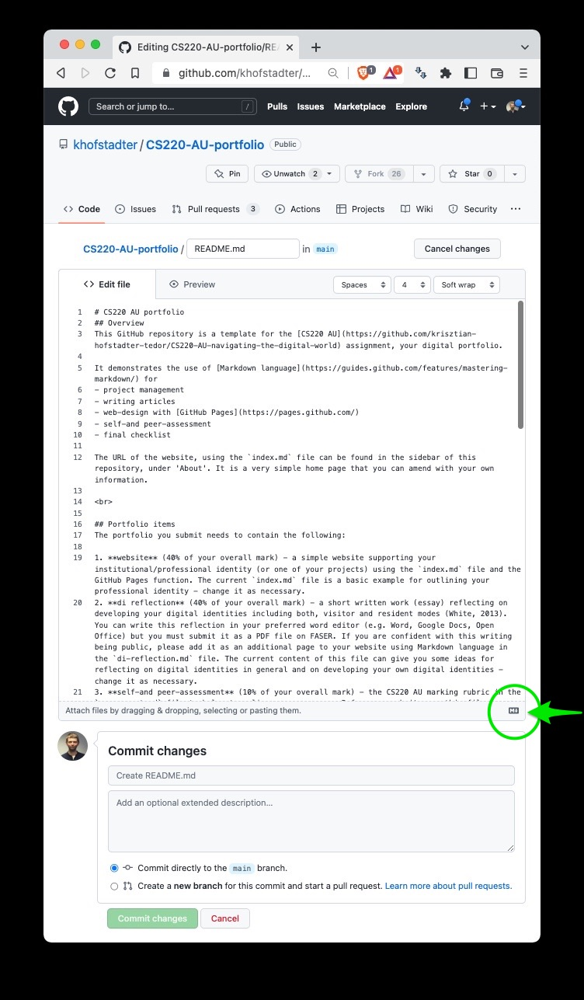

# Your Website

{: .no_toc }

## Table of contents
{: .no_toc .text-delta }

1. TOC
{:toc}

## Why build a website?
You
- **own** the content <!-- **Ownership**: You own the content, ensuring it remains unaffected by the rules and policies of third-party platforms.-->
- can have **full control** over its functions and design or timing of updates <!-- **Control**: Have full authority over the functionality and design, tailoring each aspect to your preferences and objectives.--> <!-- e.g. you don't have to wait days for someone to update you site if there is a typo-->
- can **disseminate a clean URL** to specific pages in different corners of the Web, e.g., on social media platforms, forums, emails, business cards, etc. <!-- **Distribution**: Easily share a URL across various platforms such as social media, forums, and emails, facilitating wider reach and accessibility. -->
- can give people an **overview of your past and current work** and provide an outlook, e.g., to help seek collaborators <!-- **Presentation**: Showcase your past and current projects, ideas, or products, and provide an insightful outlook to attract collaborations or opportunities.-->
- can **redesign** it whenever you feel it needs a new feel (you can even create a different feel for each page if you want) <!-- **Customization**: Refresh and redesign the website's appearance and feel whenever necessary, keeping it vibrant and engaging. -->
- can **add website skills to your CV**, e.g., web design, web hosting, and programming <!-- **Skill Acquisition**: Enhance your CV by adding valuable skills such as web design, hosting, and programming. -->
- with these new skills, can build websites for others (for **money**) <!-- **Monetization Opportunities**: Utilize your newly acquired skills to create websites for others, turning it into a potential revenue stream. --> <!-- I got employed as a freelancer and PAYE several times because of these skills -->

<!-- **Ownership**: You own the content, ensuring it remains unaffected by the rules and policies of third-party platforms.-->
  
<!-- **Control**: Have full authority over the functionality and design, tailoring each aspect to your preferences and objectives.-->
  
<!-- **Distribution**: Easily share a URL across various platforms such as social media, forums, and emails, facilitating wider reach and accessibility. -->
  
<!-- **Presentation**: Showcase your past and current projects, ideas, or products, and provide an insightful outlook to attract collaborations or opportunities.-->
  
<!-- **Customization**: Refresh and redesign the website's appearance and feel whenever necessary, keeping it vibrant and engaging. -->
  
<!-- **Skill Acquisition**: Enhance your CV by adding valuable skills such as web design, hosting, and programming. -->
  
<!-- **Monetization Opportunities**: Utilize your newly acquired skills to create websites for others, turning it into a potential revenue stream. -->

<!--
- **SEO Advantages**: Improve visibility on search engines, driving organic traffic and enhancing online presence.
  
- **Professional Image**: Elevate your professional stature, presenting yourself as a committed and profound entity in your domain.
  
- **Analytics Insight**: Harness analytical data to understand visitor behavior and traffic sources, optimizing content for better engagement and reach.
  
- **Integration Capabilities**: Seamlessly integrate various tools and platforms, creating a centralized online hub for diverse functionalities.
  
- **Interaction and Feedback**: Establish a direct communication channel for feedback and inquiries, fostering better engagement and relationship with the audience.
-->

## Types of websites

1. solo project with one main theme (e.g. [short](https://endaksi1.github.io/sonicart/) or [long](https://bcmi.khofstadter.com/) and [longer](https://enhancingaudiodescription.com))
2. multi project with several themes (e.g. [research institute](https://storylabresearch.com/) or [artist portfolio](http://rq-lightart.com/))

<!-- shall I add the other websites I built e.g. Rhea and krishofstadter.com -->

Websites can also be categorized as personal, business, e-commerce, educational, etc. 

## Website builders

There are two main types:
1. [static site generators](https://staticsitegenerators.net/) (SSG) e.g. [Jekyll](https://jekyllrb.com/) which is used with [GitHub Pages](https://pages.github.com/) when turning [Markdown files](https://docs.github.com/en/get-started/writing-on-github/getting-started-with-writing-and-formatting-on-github/basic-writing-and-formatting-syntax) into a website
2. [web content management systems](https://en.wikipedia.org/wiki/Web_content_management_system) (WCMS) e.g. [Wordpress](https://wordpress.org/), Wix, Squarespace and [other website builders](https://websitebuilder.org.uk/) with which for people without high technical skills, it could be easier to create more dynamic websites than with SSGs
- SSGs are usually free while WCMSs often have a monthly subscription fee
- both types have free and paid themes e.g. on [Jekyll Themes](https://jekyllthemes.io/) and [Themeforest](https://themeforest.net/category/wordpress)
- both types can use plugins to do a specific function. SSG plugins (e.g. [Jekyll plugins](http://www.jekyll-plugins.com/)) are usually free, while plugins for WCMSs can vary (e.g. while many of them are free, some can be expensive)
- there are many more plugins for WCMSs than for SSGs (because more people use WCMSs than SSGs)
- SSGs, in general, need more textual programming skills while WCMSs, in general, are more visual and therefore need less textual programming skills (but if something goes wrong, you might have to do some coding, or pay someone to fix you issue)

| Criteria          | SSG | WCMS |
|--------------------|------------------------------|--------------------------------------|
| Ease of Use        | Moderate                     | Easy                                |
| Customizability    | High                         | Varies                              |
| Performance        | Fast                         | Varies                              |
| Security           | High                         | Varies                              |

### Textual vs visual programming examples
The images below illustrate the difference between textual and visual programming <!-- change to png to look good on both light/dark theme -->

Markdown with preview in [VSCodium](https://vscodium.com/):

[Max](https://cycling74.com/products/max) (audio):

WordPress (WCMS):

 

### Wordpress.com vs WordPress.org
- WordPress is widely used open-source WCMS available at [WordPress.org](WordPress.org)
- the website [WordPress.com](wordpress.com) is owned by a hosting company called Automattic, where you can set up the WordPress WCMS (the process is not too technical)
- you can set up this WCMS with different hosting providers as well e.g. [TSOHost](https://www.tsohost.com/) (which can be more technical, but maybe more economic e.g. if you own many websites). You could [compare them](https://duckduckgo.com/?q=best+hosting+providers&t=brave&ia=web). 
- more info [here](https://wordpress.org/support/article/wordpress-vs-wordpress-com/)

[This video](https://youtu.be/myM1H_jAyzI) can give you some more ideas about free WCMSs.

### Custom domain
- with free websites, you often get a long domain name containing the name of the company you set your website up with e.g. 
- [https://2206217.github.io/CS220AU-DP-2022/](https://2206217.github.io/CS220AU-DP-2022/)
- https://mywebsite.wordpress.com <!-- does wix, squarespace, ... add their names to the domainame with the free/light accounts? -->
- if you want to have your own ‘custom domain’, register it with a domain registrar (which costs around £10/year) <!-- add examples -->
  - the https://github.com/krisztian-hofstadter-tedor/khofstadter.com repository is linked to the custom domain [https://khofstadter.com/](https://khofstadter.com) which I registered with [NameCheap](https://www.namecheap.com/). GitHub's GitHub Pages fuction turnes my Markdown, HTML and CSS files in this repository into a static website that costs around £10/year to run.
- I built the website [https://storylabresearch.com/](https://storylabresearch.com/) using WordPress, and are  hosing it with TSOHost, where its custom domain is registered as well (costs around £400/year to run; this cost includes a faster VPN server and an additinal extra security packages)
- websites built with other WCMSs would also [cost above £100/year](https://www.websitebuilderexpert.com/website-builders/comparisons/) to run

 

### My tedor.info to krishofstadter.com
Using the Wayback Machine on [archive.org](https://archive.org/):
- [2013](https://web.archive.org/web/20130624224549/http://tedor.info/) with [Indexhibit](https://indexhibit.org/)
- [2018](https://web.archive.org/web/20181130174711/http://www.tedor.info/) with WordPress
- [2023](https://krishofstadter.com/) with Jekyll and GithHub Pages

<!-- ### add a brief WordPress demo? -->
## SSG vs WCMS summary

| Feature/Aspect               | SSG                                                                 | WCMS |
|------------------------------|---------------------------------------------------------------------|------|
| **Page Creation**            | Pre-creates webpages, often converting Markdown files to HTML       | Pages are created when visited |
| **Data Storage**             | Data stored in website files                                       | Data like articles, images stored in a separate database file (e.g. using [MySQL](https://www.mysql.com/))|
| **Loading Speed**            | Faster loading due to pre-created files and no database usage       | Slower due to real-time page creation and database usage (there are plugins [to help with Cashe](https://www.elegantthemes.com/blog/wordpress/best-wordpress-cache-plugins))|
| **Security**                 | More secure due to pre-creation of pages, less vulnerability to malicious code injection | More vulnerable to malicious code  |
| **Hosting**                  | Versatile hosting options, often lower cost                         | More complex and potentially costly hosting due to databases |
| **Scalability**              | Highly scalable, suitable for high traffic                          | Challenges in scaling due to dynamic content and databases |
| **Development Environment**  | Requires development environment and version control knowledge     | Manageable directly on the server; no local environment usually necessary |
| **Ease of Update**           | Technical; involves working with site’s code                        | User-friendly; modifications through a GUI |
| **Content Collaboration**    | Less collaboration-friendly; requires codebase access               | Supports multiple users and roles for easier content management |
| **Plugin Availability**      | Limited plugins; functionalities might need to be built manually    | Wide variety of plugins for extended functionalities |
| **Community and Support**    | Smaller but growing community; limited forums and resources         | Large community; extensive forums and resources |
| **Main Advantages**          | Fast, more secure                                                   | More user-friendly without coding knowledge |
| **Main Disadvantages**       | Requires some coding experience                                    | Slower performance, higher security risks, more maintenance, limited advanced customization, scalability challenges |
| **CMS Addition**             | Possible to add CMS like [Jamstack](https://jamstack.org/) ([Demo](https://youtu.be/4wD00RT6d-g)) |      |

<!-- | **CDN Compatibility**        | Easily integrated with CDNs for faster global content delivery      | Requires additional configurations for CDN integrations | -->

## GitHub Pages
- [intro video](https://youtu.be/2MsN8gpT6jY)
- [documentation](https://docs.github.com/en/pages)

1. Sign up to GitHub
 - you will need an email address (perhaps use your student email address)
 - your username must be your student number (ask me if you are unsure!)
 - use a good password (check the [Password management page](password-management) for ideas)
2. Create a private repository
  - for your private notes
  - name it 'private notes'
  - initialise it with `README.md` file 
3. Fork my '[CS220AU-DP-2022](https://github.com/khofstadter/CS220AU-DP-2022)' repository
  - this will be the digital portfolio (your assignment to submit)
  - this repository will host your website as well

### Markdown language
Familiarise yourself with [Markdown language](https://guides.github.com/features/mastering-markdown/). A link to this guide can be found in the editor:

### Thoughts
- choose 'soft wrap' instead of 'no wrap' in the GitHub editor <!-- should indicate this in the screenshot above -->
- there are slightly different Markdown styles, but in general they all work the same (stick to the above link with GitHub)
- we can monitor each other's progress in the public repositories. Please update it at least once a week. <!-- TODO: make example repo for private and public. Perhaps show examples of sonic art students from ARU. -->
- [is GitHub safe to use](https://youtu.be/vAfBW1_AZkU?t=597) (e.g regarding tracking and cookies)?

### GitHub-Markdown combo for project management
GitHub's advantages:

- free
- provides version backup
- accessible and editable on mobiles via browser
- repositories can be synced to your computer (cross-platform) and then you can use desktop software to edit your files (e.g. VSCodium)
- you can drag and drop images to the editor (but I think it's better to upload it them to your `assets` folder instead to be more organized)
- can have [project boards](https://docs.github.com/en/issues/organizing-your-work-with-project-boards/managing-project-boards/about-project-boards) similar like [Trello](https://trello.com/) if needed
- you can turn your files into a very fast website for free (can be static or more complex e.g. with [Jekyll themes](https://jekyllthemes.io/free).)

GitHub's disadvantage:

- might look unfamiliar (but it's easy to learn, and will look good on your CV too)

Markdown advantages:

- its simplicity helps focus on content
- if you can't find a Markdown function for your needs, you can extend your writing with HTML/CSS and even JavaScript

<!-- #todo
- how to embed/create graphs in the markdown files in the repository e.g. in the `readme.md` file?
- we can give feedback on each work in GitHub in different ways e.g. by raising an 'Issue' or collaborating and suggesting changes <!-- #todo make screencast -->

### some shortcuts in the editor
- CTRL+b makes the highlighted words **bold**
- CTRL+i makes the highlighted words _italic_
- if you have many files, hit the letter 't' and search for the file you want to edit

<!--
## Visual Code Studio
You can find a short screencast where I introduce how VSC [here](https://youtu.be/taFSpPeHs0o) can be used with GitHub repositories.
  
You can edit your files in both, your GitHub account via a browser or in VSC on your computer. The main advantages of using VSC on your computer are that
 - you can use VSC's extensions e.g. [Foam](https://foambubble.github.io/foam/) to help organise your thoughts in a more creative, systematic way (see more info about Foam below) [1]
 - VSC's editor itself provides further clarity e.g. with colour syntax an other tools e.g. search and replace for repetitive amendments
 - generate a table of contents from headings with the 'Markdown All in One' extension
 - export in PDF with a customisable CSS stylesheet
 - once you have more notes you can use Jekyll (a static website generator) to create a novel website from your thoughts, writings and assets (e.g. images, links)
-->

## Resources
- [free website builders](https://youtu.be/myM1H_jAyzI)
- a [collection](https://github.com/collections/github-pages-examples) of nice GitHub Pages
- [colour psychology](https://www.verywellmind.com/color-psychology-2795824)
- https://marksheet.io/introduction.html
- https://www.flatfilecmslist.com/
- https://developers.google.com/web/fundamentals/
- https://devhints.io/jekyll
- https://ogp.me/
- https://moz.com/learn/seo/what-is-seo
- https://www.leadfeeder.com/blog/google-analytics-alternatives/
- https://talk.hyvor.com/blog/disqus-alternatives/
- https://www.codementor.io/
- https://www.vandelaydesign.com/beautiful-minimalist-websites/
- https://docs.github.com/en/pages
- https://marketplace.visualstudio.com/items?itemName=kamikillerto.vscode-colorize
- GitHub Desktop (backup and version control, can edit online or local, both there can be conflicts if not synced well) 
- https://html.com/
- https://www.webisland.agency/blog/
- https://programminghistorian.org/en/lessons/building-static-sites-with-jekyll-github-pages
- https://www.markdownguide.org/getting-started/
- https://grantwinney.com/cool-markdown-tricks-for-github/
- [Google Docs has Markdown support](https://support.google.com/docs/answer/12014036?hl=en-GB)
- https://www.joshuarudd.com/typeset.css/
- [Video comparing SSG with WCMS](https://youtu.be/_NZJW7IoGR4)

## Image credits
Header image was generated with Image Creator (DALL·E 3) on 19 October 2023 at 8:53 pm using "young people coding websites in Kandinsky's style".